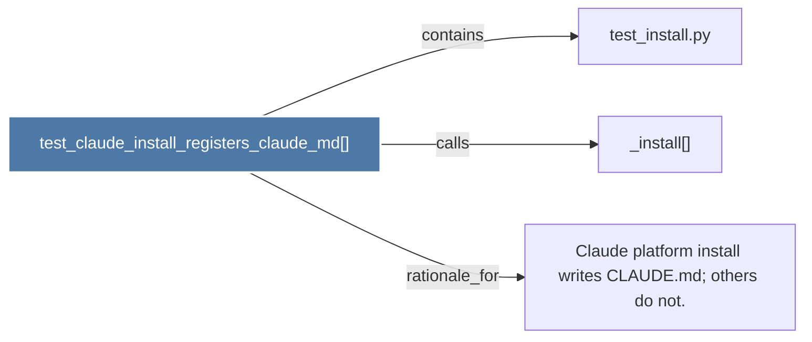

# test_claude_install_registers_claude_md()

> [!info] Properties
> **File Type**: code
> **Community**: [[_COMMUNITY_Community None|Community None]]
> **Degree**: 3

## Architecture Graph


## Outbound Connections
- [[Claude platform install writes CLAUDE.md; others do not.]] - `rationale_for` [EXTRACTED]
- [[_install()]] - `calls` [EXTRACTED]
- [[test_install.py]] - `contains` [EXTRACTED]

## Inbound Dependencies
> [!abstract]- Files that link here
```dataview
LIST
FROM [[test_claude_install_registers_claude_md()]]
```

#graphify/code #graphify/EXTRACTED #community/Community_None