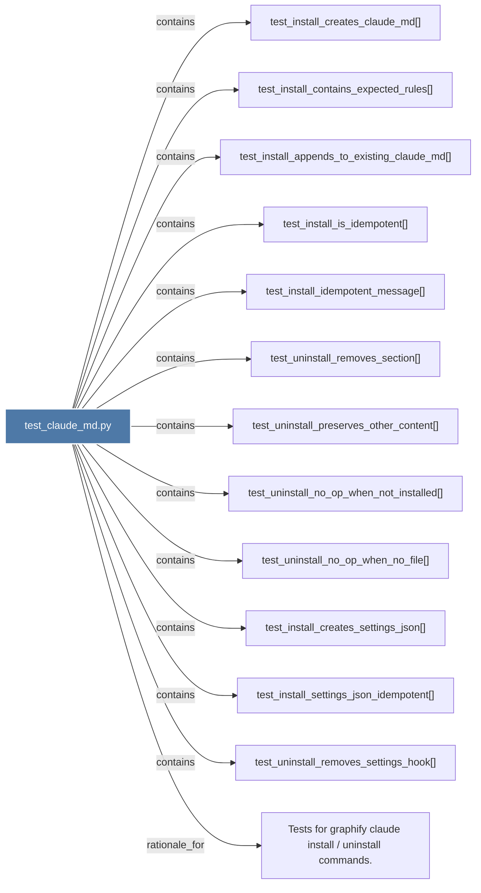

# test_claude_md.py

> [!info] Properties
> **File Type**: code
> **Community**: [[_COMMUNITY_Community None|Community None]]
> **Degree**: 13

## Architecture Graph


## Outbound Connections
- [[Tests for graphify claude install  uninstall commands.]] - `rationale_for` [EXTRACTED]
- [[test_install_appends_to_existing_claude_md()]] - `contains` [EXTRACTED]
- [[test_install_contains_expected_rules()]] - `contains` [EXTRACTED]
- [[test_install_creates_claude_md()]] - `contains` [EXTRACTED]
- [[test_install_creates_settings_json()]] - `contains` [EXTRACTED]
- [[test_install_idempotent_message()]] - `contains` [EXTRACTED]
- [[test_install_is_idempotent()]] - `contains` [EXTRACTED]
- [[test_install_settings_json_idempotent()]] - `contains` [EXTRACTED]
- [[test_uninstall_no_op_when_no_file()]] - `contains` [EXTRACTED]
- [[test_uninstall_no_op_when_not_installed()]] - `contains` [EXTRACTED]
- [[test_uninstall_preserves_other_content()]] - `contains` [EXTRACTED]
- [[test_uninstall_removes_section()]] - `contains` [EXTRACTED]
- [[test_uninstall_removes_settings_hook()]] - `contains` [EXTRACTED]

## Inbound Dependencies
> [!abstract]- Files that link here
```dataview
LIST
FROM [[test_claude_md.py]]
```

#graphify/code #graphify/EXTRACTED #community/Community_None