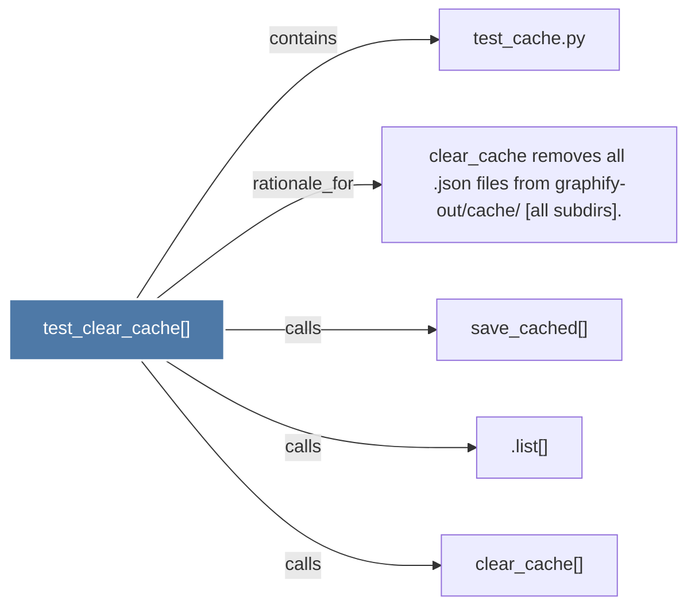

# test_clear_cache()

> [!info] Properties
> **File Type**: code
> **Community**: [[_COMMUNITY_Community None|Community None]]
> **Degree**: 5

## Architecture Graph


## Outbound Connections
- [[.list()]] - `calls` [INFERRED]
- [[clear_cache removes all .json files from graphify-outcache (all subdirs).]] - `rationale_for` [EXTRACTED]
- [[clear_cache()]] - `calls` [INFERRED]
- [[save_cached()]] - `calls` [INFERRED]
- [[test_cache.py]] - `contains` [EXTRACTED]

## Inbound Dependencies
> [!abstract]- Files that link here
```dataview
LIST
FROM [[test_clear_cache()]]
```

#graphify/code #graphify/INFERRED #community/Community_None