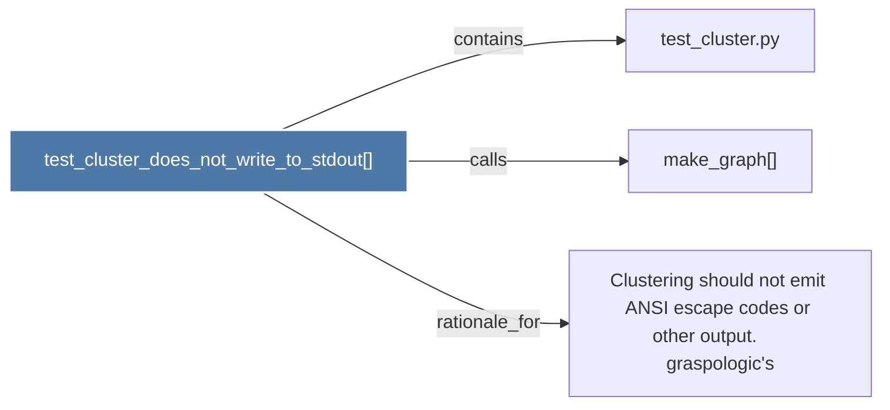

# test_cluster_does_not_write_to_stdout()

> [!info] Properties
> **File Type**: code
> **Community**: [[_COMMUNITY_Community None|Community None]]
> **Degree**: 3

## Architecture Graph


## Outbound Connections
- [[Clustering should not emit ANSI escape codes or other output.      graspologic's]] - `rationale_for` [EXTRACTED]
- [[make_graph()_1]] - `calls` [EXTRACTED]
- [[test_cluster.py]] - `contains` [EXTRACTED]

## Inbound Dependencies
> [!abstract]- Files that link here
```dataview
LIST
FROM [[test_cluster_does_not_write_to_stdout()]]
```

#graphify/code #graphify/EXTRACTED #community/Community_None