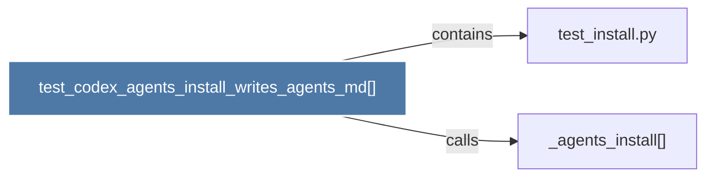

# test_codex_agents_install_writes_agents_md()

> [!info] Properties
> **File Type**: code
> **Community**: [[_COMMUNITY_Community None|Community None]]
> **Degree**: 2

## Architecture Graph


## Outbound Connections
- [[_agents_install()]] - `calls` [EXTRACTED]
- [[test_install.py]] - `contains` [EXTRACTED]

## Inbound Dependencies
> [!abstract]- Files that link here
```dataview
LIST
FROM [[test_codex_agents_install_writes_agents_md()]]
```

#graphify/code #graphify/EXTRACTED #community/Community_None