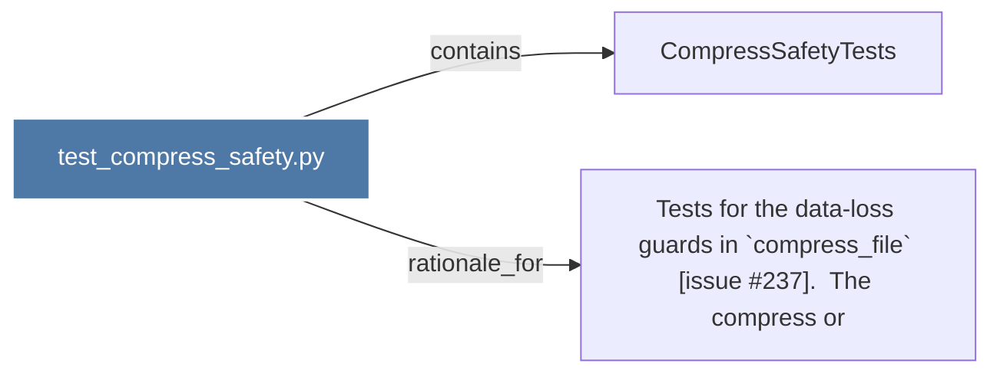

# test_compress_safety.py

> [!info] Properties
> **File Type**: code
> **Community**: [[_COMMUNITY_Community None|Community None]]
> **Degree**: 2

## Architecture Graph


## Outbound Connections
- [[CompressSafetyTests]] - `contains` [EXTRACTED]
- [[Tests for the data-loss guards in `compress_file` (issue 237).  The compress or]] - `rationale_for` [EXTRACTED]

## Inbound Dependencies
> [!abstract]- Files that link here
```dataview
LIST
FROM [[test_compress_safety.py]]
```

#graphify/code #graphify/EXTRACTED #community/Community_None