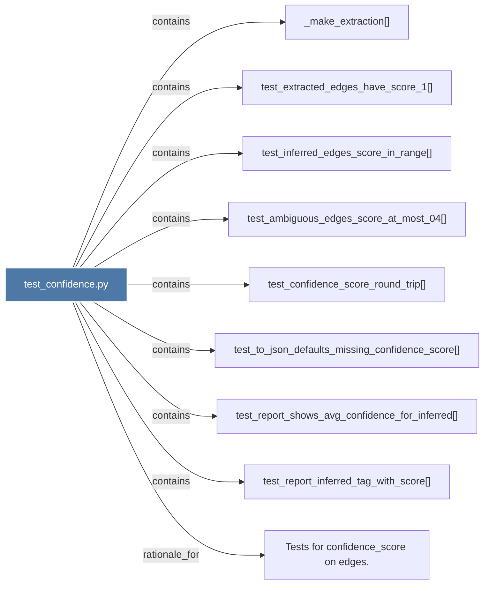

# test_confidence.py

> [!info] Properties
> **File Type**: code
> **Community**: [[_COMMUNITY_Community None|Community None]]
> **Degree**: 9

## Architecture Graph


## Outbound Connections
- [[Tests for confidence_score on edges.]] - `rationale_for` [EXTRACTED]
- [[_make_extraction()]] - `contains` [EXTRACTED]
- [[test_ambiguous_edges_score_at_most_04()]] - `contains` [EXTRACTED]
- [[test_confidence_score_round_trip()]] - `contains` [EXTRACTED]
- [[test_extracted_edges_have_score_1()]] - `contains` [EXTRACTED]
- [[test_inferred_edges_score_in_range()]] - `contains` [EXTRACTED]
- [[test_report_inferred_tag_with_score()]] - `contains` [EXTRACTED]
- [[test_report_shows_avg_confidence_for_inferred()]] - `contains` [EXTRACTED]
- [[test_to_json_defaults_missing_confidence_score()]] - `contains` [EXTRACTED]

## Inbound Dependencies
> [!abstract]- Files that link here
```dataview
LIST
FROM [[test_confidence.py]]
```

#graphify/code #graphify/EXTRACTED #community/Community_None