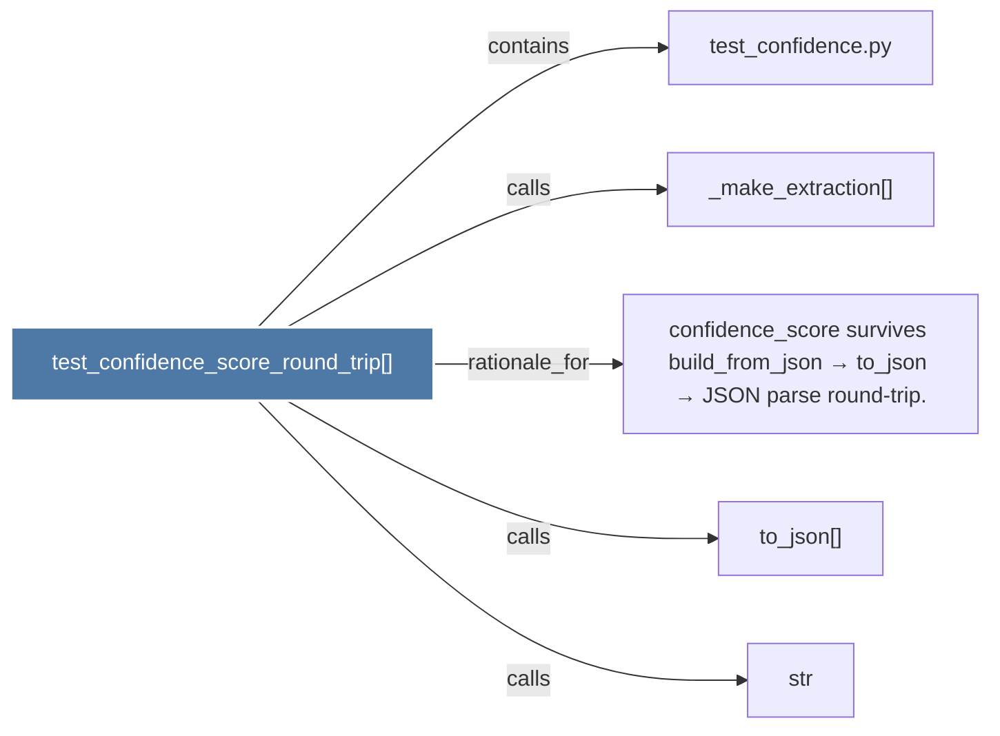

# test_confidence_score_round_trip()

> [!info] Properties
> **File Type**: code
> **Community**: [[_COMMUNITY_Community None|Community None]]
> **Degree**: 5

## Architecture Graph


## Outbound Connections
- [[_make_extraction()]] - `calls` [EXTRACTED]
- [[confidence_score survives build_from_json → to_json → JSON parse round-trip.]] - `rationale_for` [EXTRACTED]
- [[str]] - `calls` [INFERRED]
- [[test_confidence.py]] - `contains` [EXTRACTED]
- [[to_json()]] - `calls` [INFERRED]

## Inbound Dependencies
> [!abstract]- Files that link here
```dataview
LIST
FROM [[test_confidence_score_round_trip()]]
```

#graphify/code #graphify/EXTRACTED #community/Community_None