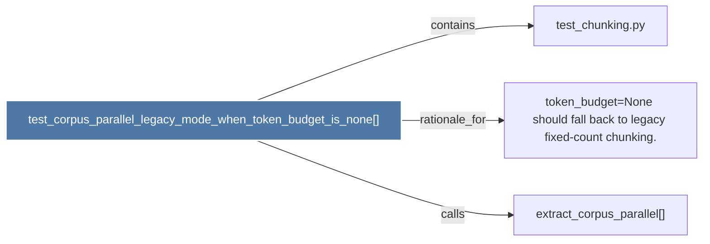

# test_corpus_parallel_legacy_mode_when_token_budget_is_none()

> [!info] Properties
> **File Type**: code
> **Community**: [[_COMMUNITY_Community None|Community None]]
> **Degree**: 3

## Architecture Graph


## Outbound Connections
- [[extract_corpus_parallel()]] - `calls` [INFERRED]
- [[test_chunking.py]] - `contains` [EXTRACTED]
- [[token_budget=None should fall back to legacy fixed-count chunking.]] - `rationale_for` [EXTRACTED]

## Inbound Dependencies
> [!abstract]- Files that link here
```dataview
LIST
FROM [[test_corpus_parallel_legacy_mode_when_token_budget_is_none()]]
```

#graphify/code #graphify/EXTRACTED #community/Community_None