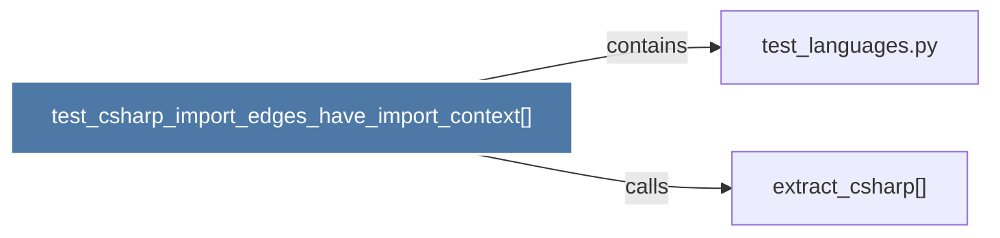

# test_csharp_import_edges_have_import_context()

> [!info] Properties
> **File Type**: code
> **Community**: [[_COMMUNITY_Community None|Community None]]
> **Degree**: 2

## Architecture Graph


## Outbound Connections
- [[extract_csharp()]] - `calls` [INFERRED]
- [[test_languages.py]] - `contains` [EXTRACTED]

## Inbound Dependencies
> [!abstract]- Files that link here
```dataview
LIST
FROM [[test_csharp_import_edges_have_import_context()]]
```

#graphify/code #graphify/EXTRACTED #community/Community_None