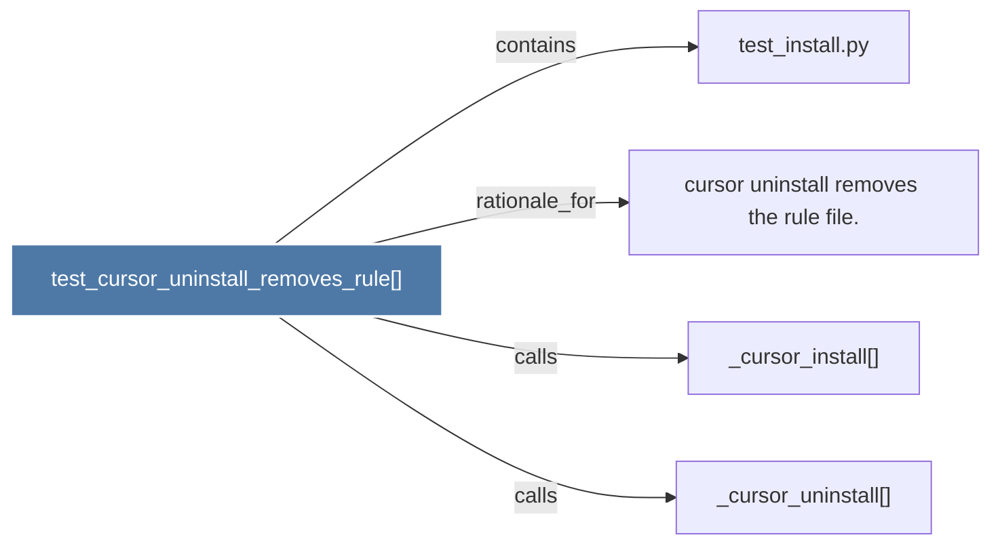

# test_cursor_uninstall_removes_rule()

> [!info] Properties
> **File Type**: code
> **Community**: [[_COMMUNITY_Community None|Community None]]
> **Degree**: 4

## Architecture Graph


## Outbound Connections
- [[_cursor_install()]] - `calls` [INFERRED]
- [[_cursor_uninstall()]] - `calls` [INFERRED]
- [[cursor uninstall removes the rule file.]] - `rationale_for` [EXTRACTED]
- [[test_install.py]] - `contains` [EXTRACTED]

## Inbound Dependencies
> [!abstract]- Files that link here
```dataview
LIST
FROM [[test_cursor_uninstall_removes_rule()]]
```

#graphify/code #graphify/EXTRACTED #community/Community_None