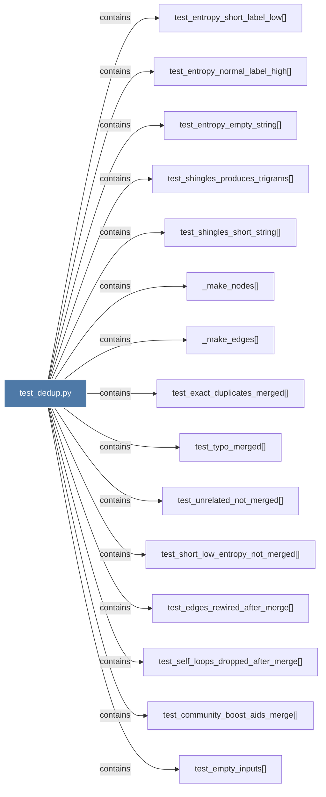

# test_dedup.py

> [!info] Properties
> **File Type**: code
> **Community**: [[_COMMUNITY_Community None|Community None]]
> **Degree**: 19

## Architecture Graph


## Outbound Connections
- [[Tests for graphifydedup.py entity deduplication pipeline.]] - `rationale_for` [EXTRACTED]
- [[_make_edges()]] - `contains` [EXTRACTED]
- [[_make_nodes()]] - `contains` [EXTRACTED]
- [[test_build_calls_dedup()]] - `contains` [EXTRACTED]
- [[test_community_boost_aids_merge()]] - `contains` [EXTRACTED]
- [[test_dedup_llm_flag_accepted()]] - `contains` [EXTRACTED]
- [[test_edges_rewired_after_merge()]] - `contains` [EXTRACTED]
- [[test_empty_inputs()]] - `contains` [EXTRACTED]
- [[test_entropy_empty_string()]] - `contains` [EXTRACTED]
- [[test_entropy_normal_label_high()]] - `contains` [EXTRACTED]
- [[test_entropy_short_label_low()]] - `contains` [EXTRACTED]
- [[test_exact_duplicates_merged()]] - `contains` [EXTRACTED]
- [[test_self_loops_dropped_after_merge()]] - `contains` [EXTRACTED]
- [[test_shingles_produces_trigrams()]] - `contains` [EXTRACTED]
- [[test_shingles_short_string()]] - `contains` [EXTRACTED]
- [[test_short_low_entropy_not_merged()]] - `contains` [EXTRACTED]
- [[test_single_node_no_crash()]] - `contains` [EXTRACTED]
- [[test_typo_merged()]] - `contains` [EXTRACTED]
- [[test_unrelated_not_merged()]] - `contains` [EXTRACTED]

## Inbound Dependencies
> [!abstract]- Files that link here
```dataview
LIST
FROM [[test_dedup.py]]
```

#graphify/code #graphify/EXTRACTED #community/Community_None