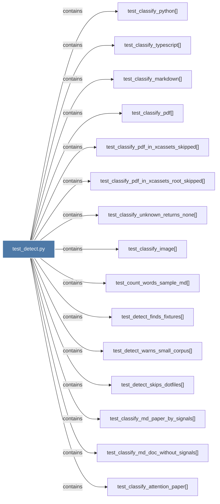

# test_detect.py

> [!info] Properties
> **File Type**: code
> **Community**: [[_COMMUNITY_Community None|Community None]]
> **Degree**: 29

## Architecture Graph


## Outbound Connections
- [[test_classify_attention_paper()]] - `contains` [EXTRACTED]
- [[test_classify_image()]] - `contains` [EXTRACTED]
- [[test_classify_markdown()]] - `contains` [EXTRACTED]
- [[test_classify_md_doc_without_signals()]] - `contains` [EXTRACTED]
- [[test_classify_md_paper_by_signals()]] - `contains` [EXTRACTED]
- [[test_classify_pdf()]] - `contains` [EXTRACTED]
- [[test_classify_pdf_in_xcassets_root_skipped()]] - `contains` [EXTRACTED]
- [[test_classify_pdf_in_xcassets_skipped()]] - `contains` [EXTRACTED]
- [[test_classify_python()]] - `contains` [EXTRACTED]
- [[test_classify_typescript()]] - `contains` [EXTRACTED]
- [[test_classify_unknown_returns_none()]] - `contains` [EXTRACTED]
- [[test_classify_video_extensions()]] - `contains` [EXTRACTED]
- [[test_count_words_sample_md()]] - `contains` [EXTRACTED]
- [[test_detect_finds_fixtures()]] - `contains` [EXTRACTED]
- [[test_detect_finds_video_files()]] - `contains` [EXTRACTED]
- [[test_detect_follows_symlinked_directory()]] - `contains` [EXTRACTED]
- [[test_detect_follows_symlinked_file()]] - `contains` [EXTRACTED]
- [[test_detect_handles_circular_symlinks()]] - `contains` [EXTRACTED]
- [[test_detect_includes_video_key()]] - `contains` [EXTRACTED]
- [[test_detect_skips_dotfiles()]] - `contains` [EXTRACTED]
- [[test_detect_video_not_in_words()]] - `contains` [EXTRACTED]
- [[test_detect_warns_small_corpus()]] - `contains` [EXTRACTED]
- [[test_graphifyignore_at_git_root_is_included()]] - `contains` [EXTRACTED]
- [[test_graphifyignore_comments_ignored()]] - `contains` [EXTRACTED]
- [[test_graphifyignore_discovered_from_parent_in_vcs()]] - `contains` [EXTRACTED]
- [[test_graphifyignore_excludes_file()]] - `contains` [EXTRACTED]
- [[test_graphifyignore_hermetic_without_vcs()]] - `contains` [EXTRACTED]
- [[test_graphifyignore_missing_is_fine()]] - `contains` [EXTRACTED]
- [[test_graphifyignore_stops_at_git_boundary()]] - `contains` [EXTRACTED]

## Inbound Dependencies
> [!abstract]- Files that link here
```dataview
LIST
FROM [[test_detect.py]]
```

#graphify/code #graphify/EXTRACTED #community/Community_None