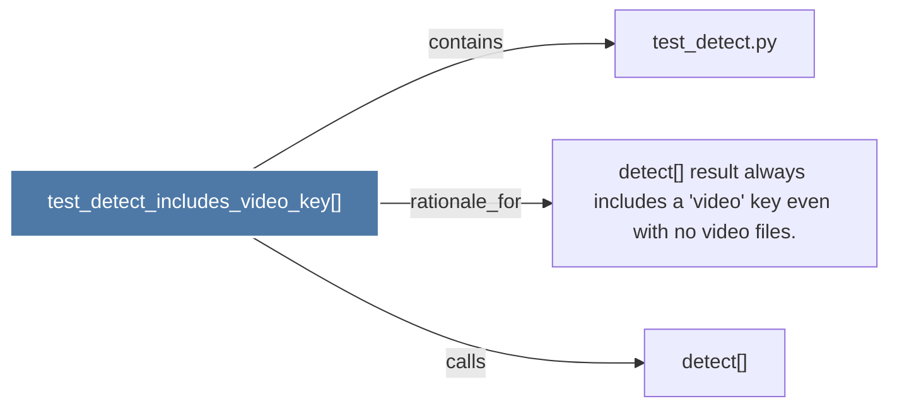

# test_detect_includes_video_key()

> [!info] Properties
> **File Type**: code
> **Community**: [[_COMMUNITY_Community None|Community None]]
> **Degree**: 3

## Architecture Graph


## Outbound Connections
- [[detect()]] - `calls` [INFERRED]
- [[detect() result always includes a 'video' key even with no video files.]] - `rationale_for` [EXTRACTED]
- [[test_detect.py]] - `contains` [EXTRACTED]

## Inbound Dependencies
> [!abstract]- Files that link here
```dataview
LIST
FROM [[test_detect_includes_video_key()]]
```

#graphify/code #graphify/EXTRACTED #community/Community_None