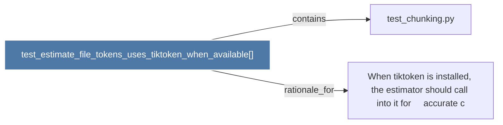

# test_estimate_file_tokens_uses_tiktoken_when_available()

> [!info] Properties
> **File Type**: code
> **Community**: [[_COMMUNITY_Community None|Community None]]
> **Degree**: 2

## Architecture Graph


## Outbound Connections
- [[When tiktoken is installed, the estimator should call into it for     accurate c]] - `rationale_for` [EXTRACTED]
- [[test_chunking.py]] - `contains` [EXTRACTED]

## Inbound Dependencies
> [!abstract]- Files that link here
```dataview
LIST
FROM [[test_estimate_file_tokens_uses_tiktoken_when_available()]]
```

#graphify/code #graphify/EXTRACTED #community/Community_None