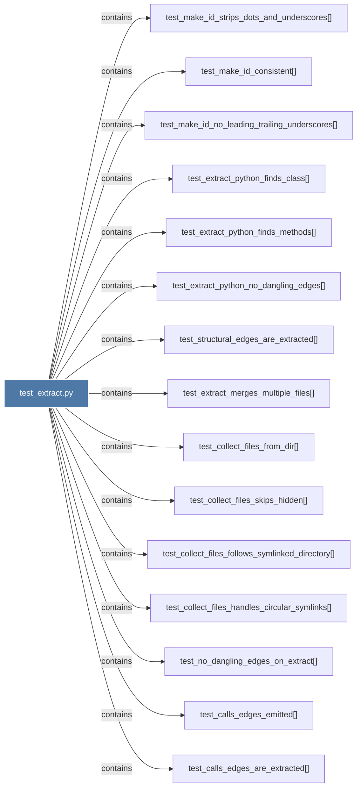

# test_extract.py

> [!info] Properties
> **File Type**: code
> **Community**: [[_COMMUNITY_Community None|Community None]]
> **Degree**: 22

## Architecture Graph


## Outbound Connections
- [[test_calls_deduplication()]] - `contains` [EXTRACTED]
- [[test_calls_edges_are_extracted()]] - `contains` [EXTRACTED]
- [[test_calls_edges_emitted()]] - `contains` [EXTRACTED]
- [[test_calls_no_self_loops()]] - `contains` [EXTRACTED]
- [[test_collect_files_follows_symlinked_directory()]] - `contains` [EXTRACTED]
- [[test_collect_files_from_dir()]] - `contains` [EXTRACTED]
- [[test_collect_files_handles_circular_symlinks()]] - `contains` [EXTRACTED]
- [[test_collect_files_skips_hidden()]] - `contains` [EXTRACTED]
- [[test_cross_file_calls_skip_ambiguous_duplicate_labels()]] - `contains` [EXTRACTED]
- [[test_extract_merges_multiple_files()]] - `contains` [EXTRACTED]
- [[test_extract_python_finds_class()]] - `contains` [EXTRACTED]
- [[test_extract_python_finds_methods()]] - `contains` [EXTRACTED]
- [[test_extract_python_no_dangling_edges()]] - `contains` [EXTRACTED]
- [[test_make_id_consistent()]] - `contains` [EXTRACTED]
- [[test_make_id_no_leading_trailing_underscores()]] - `contains` [EXTRACTED]
- [[test_make_id_strips_dots_and_underscores()]] - `contains` [EXTRACTED]
- [[test_method_calls_module_function()]] - `contains` [EXTRACTED]
- [[test_no_dangling_edges_on_extract()]] - `contains` [EXTRACTED]
- [[test_python_call_edges_have_call_context()]] - `contains` [EXTRACTED]
- [[test_run_analysis_calls_compute_score()]] - `contains` [EXTRACTED]
- [[test_run_analysis_calls_normalize()]] - `contains` [EXTRACTED]
- [[test_structural_edges_are_extracted()]] - `contains` [EXTRACTED]

## Inbound Dependencies
> [!abstract]- Files that link here
```dataview
LIST
FROM [[test_extract.py]]
```

#graphify/code #graphify/EXTRACTED #community/Community_None