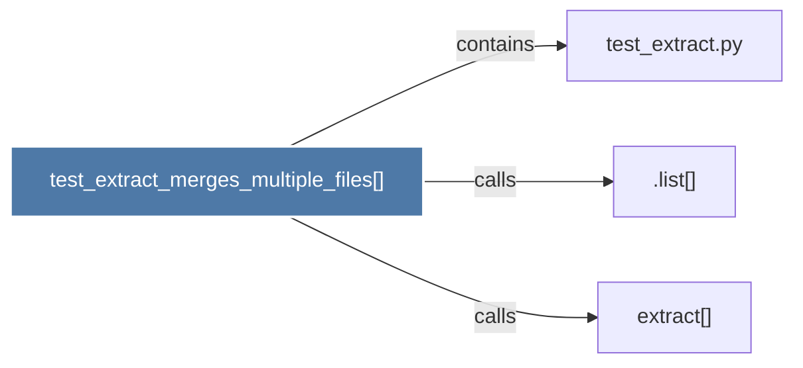

# test_extract_merges_multiple_files()

> [!info] Properties
> **File Type**: code
> **Community**: [[_COMMUNITY_Community None|Community None]]
> **Degree**: 3

## Architecture Graph


## Outbound Connections
- [[.list()]] - `calls` [INFERRED]
- [[extract()]] - `calls` [INFERRED]
- [[test_extract.py]] - `contains` [EXTRACTED]

## Inbound Dependencies
> [!abstract]- Files that link here
```dataview
LIST
FROM [[test_extract_merges_multiple_files()]]
```

#graphify/code #graphify/INFERRED #community/Community_None