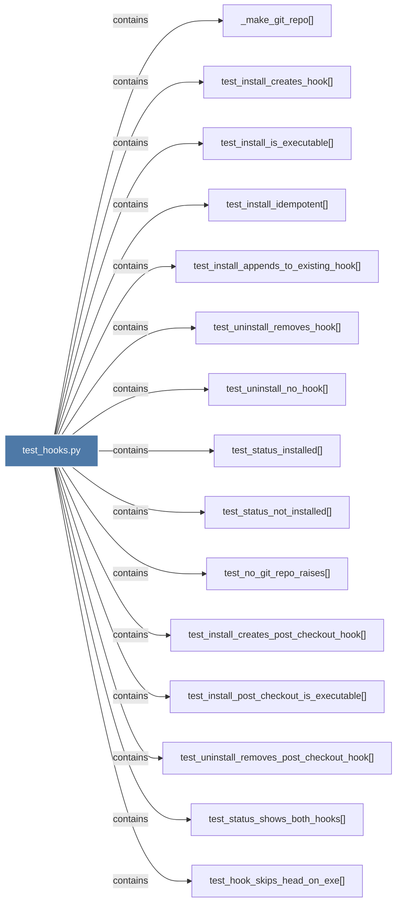

# test_hooks.py

> [!info] Properties
> **File Type**: code
> **Community**: [[_COMMUNITY_Community None|Community None]]
> **Degree**: 17

## Architecture Graph


## Outbound Connections
- [[Tests for hooks.py - git hook installuninstall.]] - `rationale_for` [EXTRACTED]
- [[_make_git_repo()]] - `contains` [EXTRACTED]
- [[test_hook_check_no_additionalContext()]] - `contains` [EXTRACTED]
- [[test_hook_skips_head_on_exe()]] - `contains` [EXTRACTED]
- [[test_install_appends_to_existing_hook()]] - `contains` [EXTRACTED]
- [[test_install_creates_hook()]] - `contains` [EXTRACTED]
- [[test_install_creates_post_checkout_hook()]] - `contains` [EXTRACTED]
- [[test_install_idempotent()]] - `contains` [EXTRACTED]
- [[test_install_is_executable()]] - `contains` [EXTRACTED]
- [[test_install_post_checkout_is_executable()]] - `contains` [EXTRACTED]
- [[test_no_git_repo_raises()]] - `contains` [EXTRACTED]
- [[test_status_installed()]] - `contains` [EXTRACTED]
- [[test_status_not_installed()]] - `contains` [EXTRACTED]
- [[test_status_shows_both_hooks()]] - `contains` [EXTRACTED]
- [[test_uninstall_no_hook()]] - `contains` [EXTRACTED]
- [[test_uninstall_removes_hook()]] - `contains` [EXTRACTED]
- [[test_uninstall_removes_post_checkout_hook()]] - `contains` [EXTRACTED]

## Inbound Dependencies
> [!abstract]- Files that link here
```dataview
LIST
FROM [[test_hooks.py]]
```

#graphify/code #graphify/EXTRACTED #community/Community_None