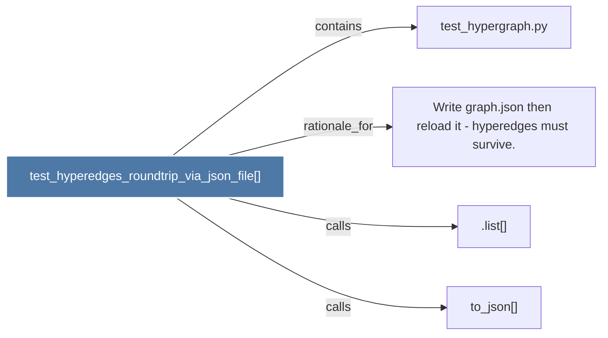

# test_hyperedges_roundtrip_via_json_file()

> [!info] Properties
> **File Type**: code
> **Community**: [[_COMMUNITY_Community None|Community None]]
> **Degree**: 4

## Architecture Graph


## Outbound Connections
- [[.list()]] - `calls` [INFERRED]
- [[Write graph.json then reload it - hyperedges must survive.]] - `rationale_for` [EXTRACTED]
- [[test_hypergraph.py]] - `contains` [EXTRACTED]
- [[to_json()]] - `calls` [INFERRED]

## Inbound Dependencies
> [!abstract]- Files that link here
```dataview
LIST
FROM [[test_hyperedges_roundtrip_via_json_file()]]
```

#graphify/code #graphify/EXTRACTED #community/Community_None