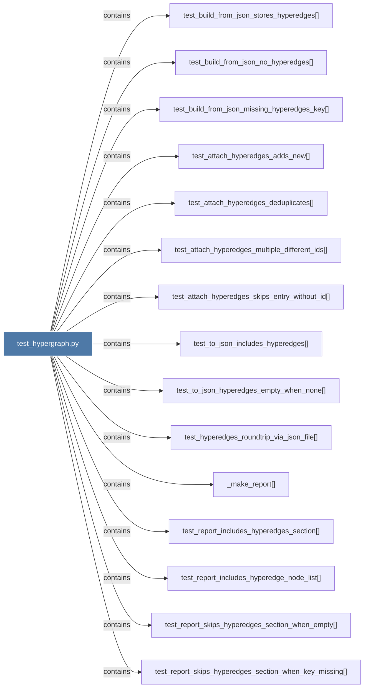

# test_hypergraph.py

> [!info] Properties
> **File Type**: code
> **Community**: [[_COMMUNITY_Community None|Community None]]
> **Degree**: 16

## Architecture Graph


## Outbound Connections
- [[Tests for hyperedge support in graphify.]] - `rationale_for` [EXTRACTED]
- [[_make_report()]] - `contains` [EXTRACTED]
- [[test_attach_hyperedges_adds_new()]] - `contains` [EXTRACTED]
- [[test_attach_hyperedges_deduplicates()]] - `contains` [EXTRACTED]
- [[test_attach_hyperedges_multiple_different_ids()]] - `contains` [EXTRACTED]
- [[test_attach_hyperedges_skips_entry_without_id()]] - `contains` [EXTRACTED]
- [[test_build_from_json_missing_hyperedges_key()]] - `contains` [EXTRACTED]
- [[test_build_from_json_no_hyperedges()]] - `contains` [EXTRACTED]
- [[test_build_from_json_stores_hyperedges()]] - `contains` [EXTRACTED]
- [[test_hyperedges_roundtrip_via_json_file()]] - `contains` [EXTRACTED]
- [[test_report_includes_hyperedge_node_list()]] - `contains` [EXTRACTED]
- [[test_report_includes_hyperedges_section()]] - `contains` [EXTRACTED]
- [[test_report_skips_hyperedges_section_when_empty()]] - `contains` [EXTRACTED]
- [[test_report_skips_hyperedges_section_when_key_missing()]] - `contains` [EXTRACTED]
- [[test_to_json_hyperedges_empty_when_none()]] - `contains` [EXTRACTED]
- [[test_to_json_includes_hyperedges()]] - `contains` [EXTRACTED]

## Inbound Dependencies
> [!abstract]- Files that link here
```dataview
LIST
FROM [[test_hypergraph.py]]
```

#graphify/code #graphify/EXTRACTED #community/Community_None