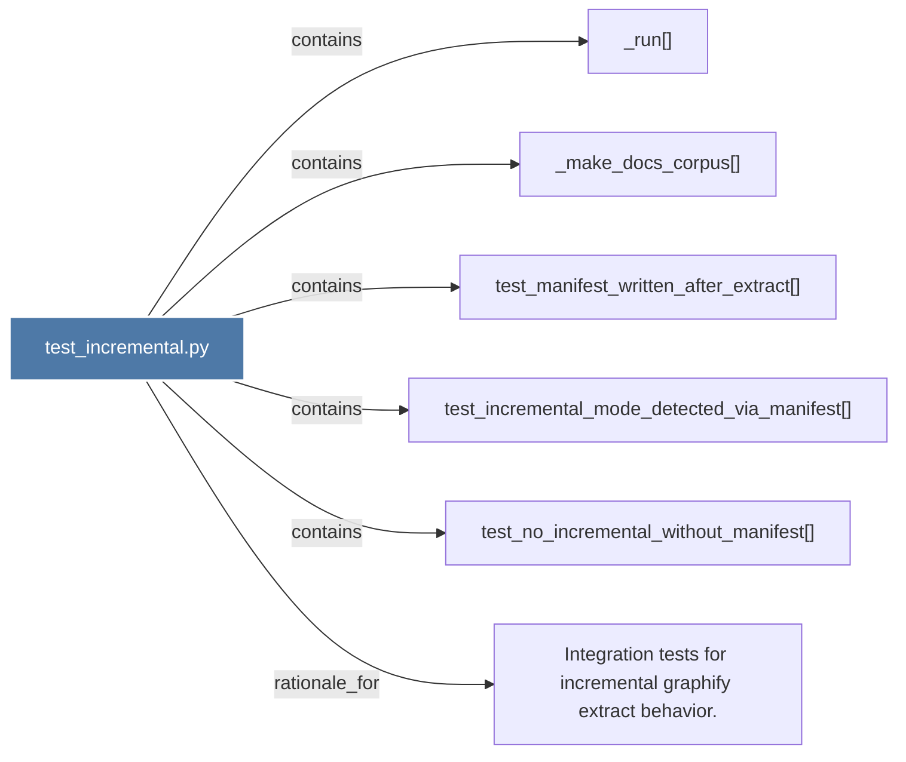

# test_incremental.py

> [!info] Properties
> **File Type**: code
> **Community**: [[_COMMUNITY_Community None|Community None]]
> **Degree**: 6

## Architecture Graph


## Outbound Connections
- [[Integration tests for incremental graphify extract behavior.]] - `rationale_for` [EXTRACTED]
- [[_make_docs_corpus()]] - `contains` [EXTRACTED]
- [[_run()_1]] - `contains` [EXTRACTED]
- [[test_incremental_mode_detected_via_manifest()]] - `contains` [EXTRACTED]
- [[test_manifest_written_after_extract()]] - `contains` [EXTRACTED]
- [[test_no_incremental_without_manifest()]] - `contains` [EXTRACTED]

## Inbound Dependencies
> [!abstract]- Files that link here
```dataview
LIST
FROM [[test_incremental.py]]
```

#graphify/code #graphify/EXTRACTED #community/Community_None