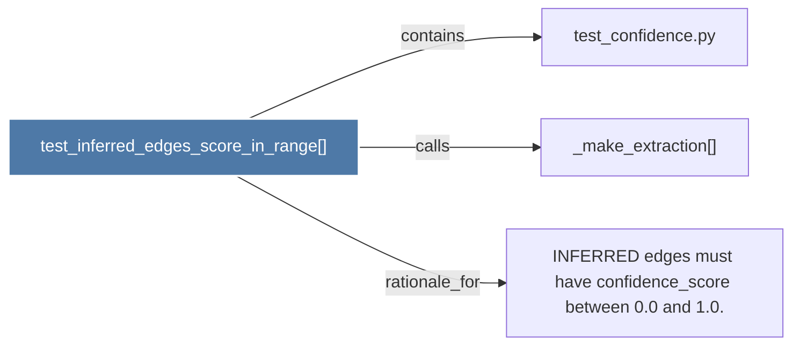

# test_inferred_edges_score_in_range()

> [!info] Properties
> **File Type**: code
> **Community**: [[_COMMUNITY_Community None|Community None]]
> **Degree**: 3

## Architecture Graph


## Outbound Connections
- [[INFERRED edges must have confidence_score between 0.0 and 1.0.]] - `rationale_for` [EXTRACTED]
- [[_make_extraction()]] - `calls` [EXTRACTED]
- [[test_confidence.py]] - `contains` [EXTRACTED]

## Inbound Dependencies
> [!abstract]- Files that link here
```dataview
LIST
FROM [[test_inferred_edges_score_in_range()]]
```

#graphify/code #graphify/EXTRACTED #community/Community_None