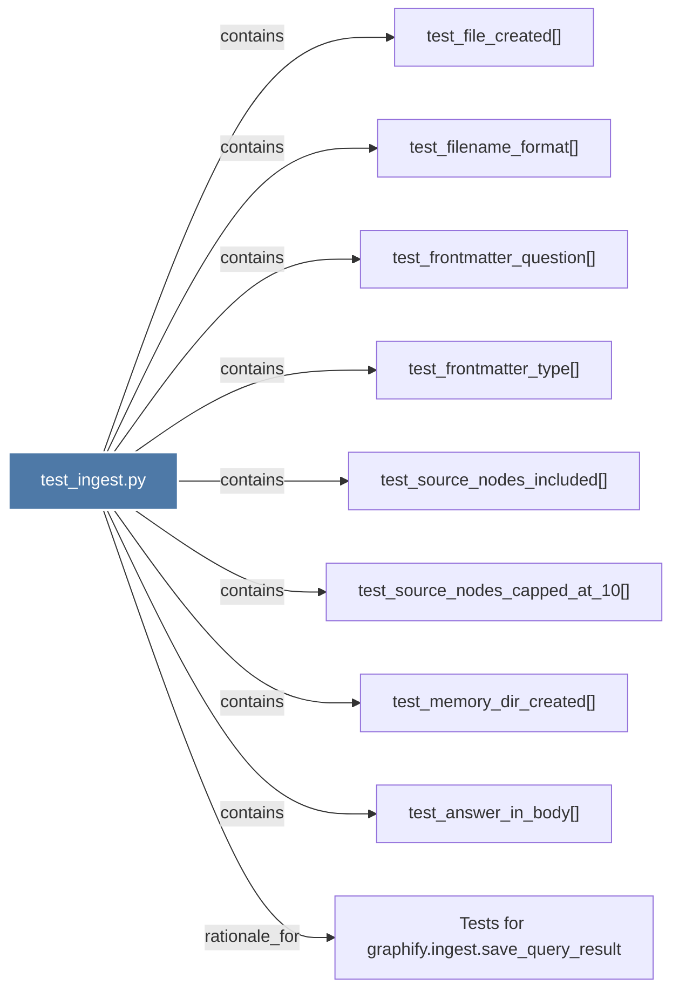

# test_ingest.py

> [!info] Properties
> **File Type**: code
> **Community**: [[_COMMUNITY_Community None|Community None]]
> **Degree**: 9

## Architecture Graph


## Outbound Connections
- [[Tests for graphify.ingest.save_query_result]] - `rationale_for` [EXTRACTED]
- [[test_answer_in_body()]] - `contains` [EXTRACTED]
- [[test_file_created()]] - `contains` [EXTRACTED]
- [[test_filename_format()]] - `contains` [EXTRACTED]
- [[test_frontmatter_question()]] - `contains` [EXTRACTED]
- [[test_frontmatter_type()]] - `contains` [EXTRACTED]
- [[test_memory_dir_created()]] - `contains` [EXTRACTED]
- [[test_source_nodes_capped_at_10()]] - `contains` [EXTRACTED]
- [[test_source_nodes_included()]] - `contains` [EXTRACTED]

## Inbound Dependencies
> [!abstract]- Files that link here
```dataview
LIST
FROM [[test_ingest.py]]
```

#graphify/code #graphify/EXTRACTED #community/Community_None