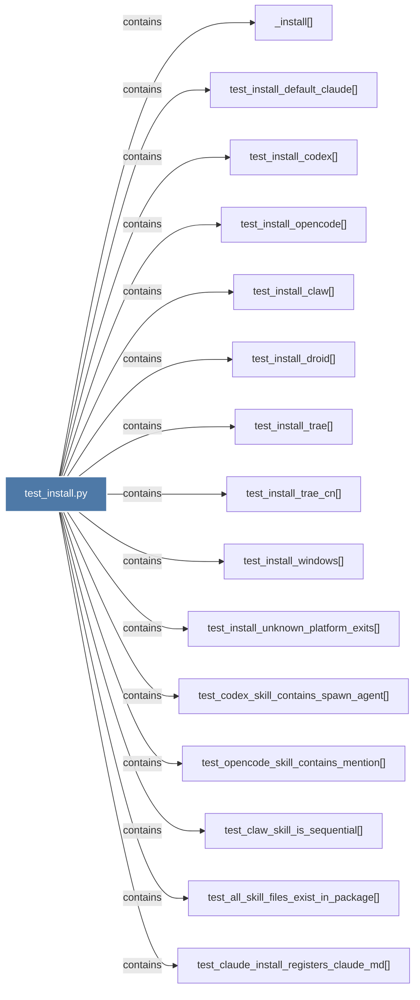

# test_install.py

> [!info] Properties
> **File Type**: code
> **Community**: [[_COMMUNITY_Community None|Community None]]
> **Degree**: 42

## Architecture Graph


## Outbound Connections
- [[Tests for graphify install --platform routing.]] - `rationale_for` [EXTRACTED]
- [[_agents_install()]] - `contains` [EXTRACTED]
- [[_agents_uninstall()]] - `contains` [EXTRACTED]
- [[_install()]] - `contains` [EXTRACTED]
- [[test_agents_install_appends_to_existing()]] - `contains` [EXTRACTED]
- [[test_agents_install_idempotent()]] - `contains` [EXTRACTED]
- [[test_agents_uninstall_no_op_when_not_installed()]] - `contains` [EXTRACTED]
- [[test_agents_uninstall_preserves_other_content()]] - `contains` [EXTRACTED]
- [[test_agents_uninstall_removes_section()]] - `contains` [EXTRACTED]
- [[test_all_skill_files_exist_in_package()]] - `contains` [EXTRACTED]
- [[test_claude_install_registers_claude_md()]] - `contains` [EXTRACTED]
- [[test_claw_agents_install_writes_agents_md()]] - `contains` [EXTRACTED]
- [[test_claw_skill_is_sequential()]] - `contains` [EXTRACTED]
- [[test_codex_agents_install_writes_agents_md()]] - `contains` [EXTRACTED]
- [[test_codex_install_does_not_write_claude_md()]] - `contains` [EXTRACTED]
- [[test_codex_skill_contains_spawn_agent()]] - `contains` [EXTRACTED]
- [[test_cursor_install_idempotent()]] - `contains` [EXTRACTED]
- [[test_cursor_install_writes_rule()]] - `contains` [EXTRACTED]
- [[test_cursor_uninstall_noop_if_not_installed()]] - `contains` [EXTRACTED]
- [[test_cursor_uninstall_removes_rule()]] - `contains` [EXTRACTED]
- [[test_gemini_install_idempotent()]] - `contains` [EXTRACTED]
- [[test_gemini_install_merges_existing_gemini_md()]] - `contains` [EXTRACTED]
- [[test_gemini_install_writes_gemini_md()]] - `contains` [EXTRACTED]
- [[test_gemini_install_writes_hook()]] - `contains` [EXTRACTED]
- [[test_gemini_uninstall_noop_if_not_installed()]] - `contains` [EXTRACTED]
- [[test_gemini_uninstall_removes_hook()]] - `contains` [EXTRACTED]
- [[test_gemini_uninstall_removes_section()]] - `contains` [EXTRACTED]
- [[test_install_claw()]] - `contains` [EXTRACTED]
- [[test_install_codex()]] - `contains` [EXTRACTED]
- [[test_install_default_claude()]] - `contains` [EXTRACTED]
- [[test_install_droid()]] - `contains` [EXTRACTED]
- [[test_install_opencode()]] - `contains` [EXTRACTED]
- [[test_install_trae()]] - `contains` [EXTRACTED]
- [[test_install_trae_cn()]] - `contains` [EXTRACTED]
- [[test_install_unknown_platform_exits()]] - `contains` [EXTRACTED]
- [[test_install_windows()]] - `contains` [EXTRACTED]
- [[test_opencode_agents_install_merges_existing_config()]] - `contains` [EXTRACTED]
- [[test_opencode_agents_install_registers_plugin_in_config()]] - `contains` [EXTRACTED]
- [[test_opencode_agents_install_writes_agents_md()]] - `contains` [EXTRACTED]
- [[test_opencode_agents_install_writes_plugin()]] - `contains` [EXTRACTED]
- [[test_opencode_agents_uninstall_removes_plugin()]] - `contains` [EXTRACTED]
- [[test_opencode_skill_contains_mention()]] - `contains` [EXTRACTED]

## Inbound Dependencies
> [!abstract]- Files that link here
```dataview
LIST
FROM [[test_install.py]]
```

#graphify/code #graphify/EXTRACTED #community/Community_None