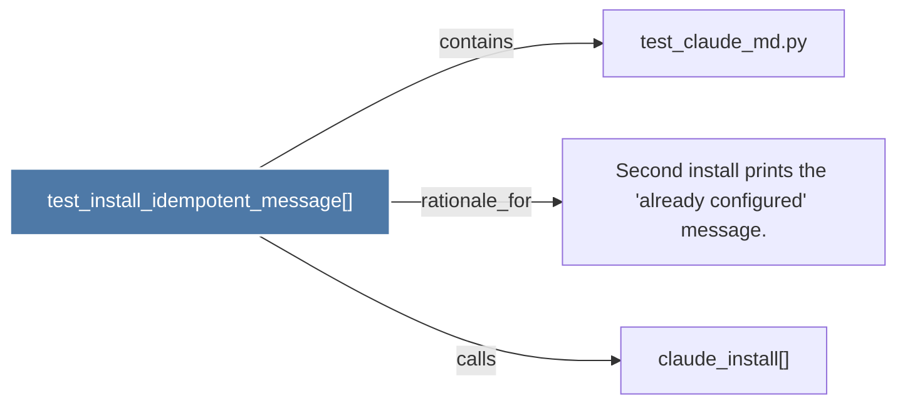

# test_install_idempotent_message()

> [!info] Properties
> **File Type**: code
> **Community**: [[_COMMUNITY_Community None|Community None]]
> **Degree**: 3

## Architecture Graph


## Outbound Connections
- [[Second install prints the 'already configured' message.]] - `rationale_for` [EXTRACTED]
- [[claude_install()]] - `calls` [INFERRED]
- [[test_claude_md.py]] - `contains` [EXTRACTED]

## Inbound Dependencies
> [!abstract]- Files that link here
```dataview
LIST
FROM [[test_install_idempotent_message()]]
```

#graphify/code #graphify/EXTRACTED #community/Community_None