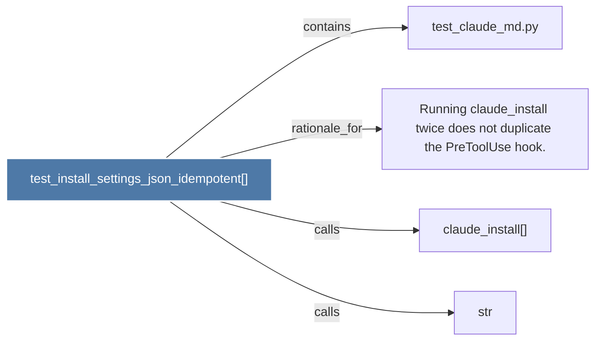

# test_install_settings_json_idempotent()

> [!info] Properties
> **File Type**: code
> **Community**: [[_COMMUNITY_Community None|Community None]]
> **Degree**: 4

## Architecture Graph


## Outbound Connections
- [[Running claude_install twice does not duplicate the PreToolUse hook.]] - `rationale_for` [EXTRACTED]
- [[claude_install()]] - `calls` [INFERRED]
- [[str]] - `calls` [INFERRED]
- [[test_claude_md.py]] - `contains` [EXTRACTED]

## Inbound Dependencies
> [!abstract]- Files that link here
```dataview
LIST
FROM [[test_install_settings_json_idempotent()]]
```

#graphify/code #graphify/EXTRACTED #community/Community_None