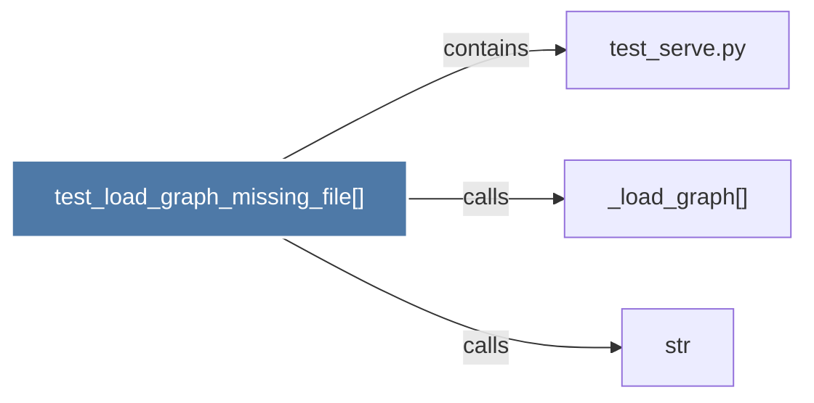

# test_load_graph_missing_file()

> [!info] Properties
> **File Type**: code
> **Community**: [[_COMMUNITY_Community None|Community None]]
> **Degree**: 3

## Architecture Graph


## Outbound Connections
- [[_load_graph()]] - `calls` [INFERRED]
- [[str]] - `calls` [INFERRED]
- [[test_serve.py]] - `contains` [EXTRACTED]

## Inbound Dependencies
> [!abstract]- Files that link here
```dataview
LIST
FROM [[test_load_graph_missing_file()]]
```

#graphify/code #graphify/INFERRED #community/Community_None