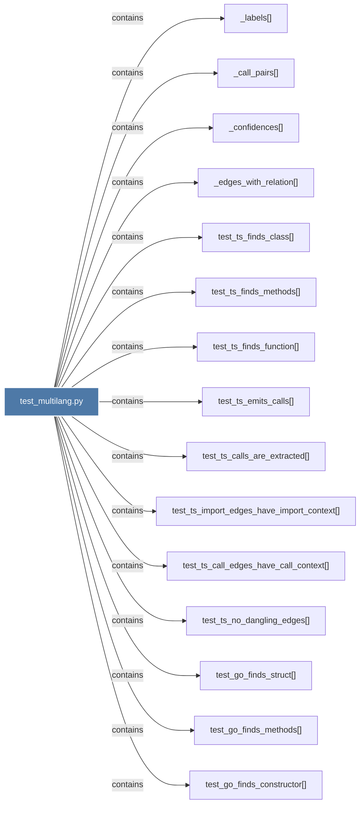

# test_multilang.py

> [!info] Properties
> **File Type**: code
> **Community**: [[_COMMUNITY_Community None|Community None]]
> **Degree**: 38

## Architecture Graph


## Outbound Connections
- [[Tests for multi-language AST extraction JSTS, Go, Rust, SQL.]] - `rationale_for` [EXTRACTED]
- [[_call_pairs()]] - `contains` [EXTRACTED]
- [[_confidences()]] - `contains` [EXTRACTED]
- [[_edges_with_relation()_1]] - `contains` [EXTRACTED]
- [[_labels()_1]] - `contains` [EXTRACTED]
- [[test_cache_hit_returns_same_result()]] - `contains` [EXTRACTED]
- [[test_cache_miss_after_file_change()]] - `contains` [EXTRACTED]
- [[test_extract_dispatches_all_languages()]] - `contains` [EXTRACTED]
- [[test_go_call_edges_have_call_context()]] - `contains` [EXTRACTED]
- [[test_go_emits_calls()]] - `contains` [EXTRACTED]
- [[test_go_finds_constructor()]] - `contains` [EXTRACTED]
- [[test_go_finds_methods()]] - `contains` [EXTRACTED]
- [[test_go_finds_struct()]] - `contains` [EXTRACTED]
- [[test_go_has_extracted_calls()]] - `contains` [EXTRACTED]
- [[test_go_import_edges_have_import_context()]] - `contains` [EXTRACTED]
- [[test_go_no_dangling_edges()]] - `contains` [EXTRACTED]
- [[test_rust_call_edges_have_call_context()]] - `contains` [EXTRACTED]
- [[test_rust_calls_are_extracted()]] - `contains` [EXTRACTED]
- [[test_rust_emits_calls()]] - `contains` [EXTRACTED]
- [[test_rust_finds_function()]] - `contains` [EXTRACTED]
- [[test_rust_finds_impl_methods()]] - `contains` [EXTRACTED]
- [[test_rust_finds_struct()]] - `contains` [EXTRACTED]
- [[test_rust_import_edges_have_import_context()]] - `contains` [EXTRACTED]
- [[test_rust_no_dangling_edges()]] - `contains` [EXTRACTED]
- [[test_sql_emits_foreign_key_edge()]] - `contains` [EXTRACTED]
- [[test_sql_emits_reads_from_edge()]] - `contains` [EXTRACTED]
- [[test_sql_finds_function()]] - `contains` [EXTRACTED]
- [[test_sql_finds_tables()]] - `contains` [EXTRACTED]
- [[test_sql_finds_view()]] - `contains` [EXTRACTED]
- [[test_sql_no_dangling_edges()]] - `contains` [EXTRACTED]
- [[test_ts_call_edges_have_call_context()]] - `contains` [EXTRACTED]
- [[test_ts_calls_are_extracted()]] - `contains` [EXTRACTED]
- [[test_ts_emits_calls()]] - `contains` [EXTRACTED]
- [[test_ts_finds_class()]] - `contains` [EXTRACTED]
- [[test_ts_finds_function()]] - `contains` [EXTRACTED]
- [[test_ts_finds_methods()]] - `contains` [EXTRACTED]
- [[test_ts_import_edges_have_import_context()]] - `contains` [EXTRACTED]
- [[test_ts_no_dangling_edges()]] - `contains` [EXTRACTED]

## Inbound Dependencies
> [!abstract]- Files that link here
```dataview
LIST
FROM [[test_multilang.py]]
```

#graphify/code #graphify/EXTRACTED #community/Community_None