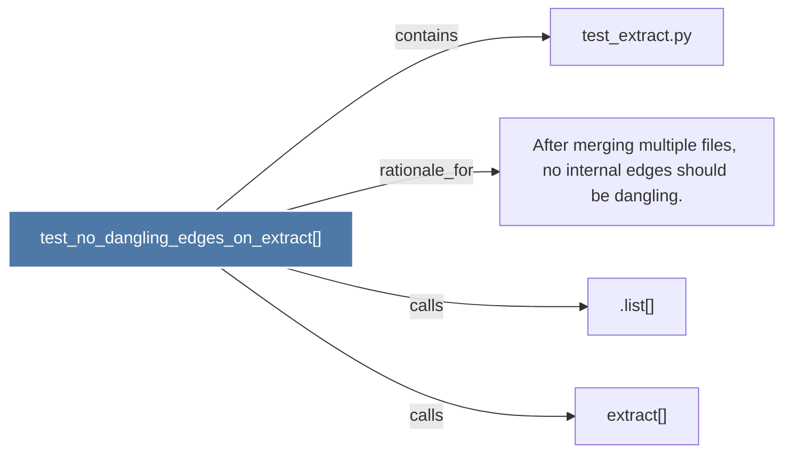

# test_no_dangling_edges_on_extract()

> [!info] Properties
> **File Type**: code
> **Community**: [[_COMMUNITY_Community None|Community None]]
> **Degree**: 4

## Architecture Graph


## Outbound Connections
- [[.list()]] - `calls` [INFERRED]
- [[After merging multiple files, no internal edges should be dangling.]] - `rationale_for` [EXTRACTED]
- [[extract()]] - `calls` [INFERRED]
- [[test_extract.py]] - `contains` [EXTRACTED]

## Inbound Dependencies
> [!abstract]- Files that link here
```dataview
LIST
FROM [[test_no_dangling_edges_on_extract()]]
```

#graphify/code #graphify/EXTRACTED #community/Community_None