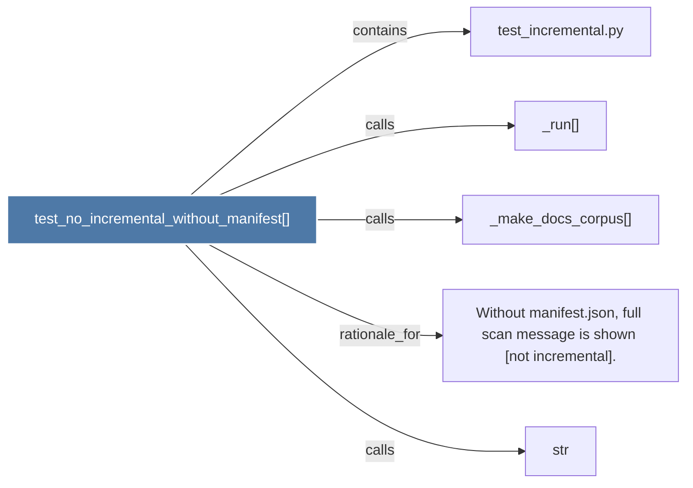

# test_no_incremental_without_manifest()

> [!info] Properties
> **File Type**: code
> **Community**: [[_COMMUNITY_Community None|Community None]]
> **Degree**: 5

## Architecture Graph


## Outbound Connections
- [[Without manifest.json, full scan message is shown (not incremental).]] - `rationale_for` [EXTRACTED]
- [[_make_docs_corpus()]] - `calls` [EXTRACTED]
- [[_run()_1]] - `calls` [EXTRACTED]
- [[str]] - `calls` [INFERRED]
- [[test_incremental.py]] - `contains` [EXTRACTED]

## Inbound Dependencies
> [!abstract]- Files that link here
```dataview
LIST
FROM [[test_no_incremental_without_manifest()]]
```

#graphify/code #graphify/EXTRACTED #community/Community_None