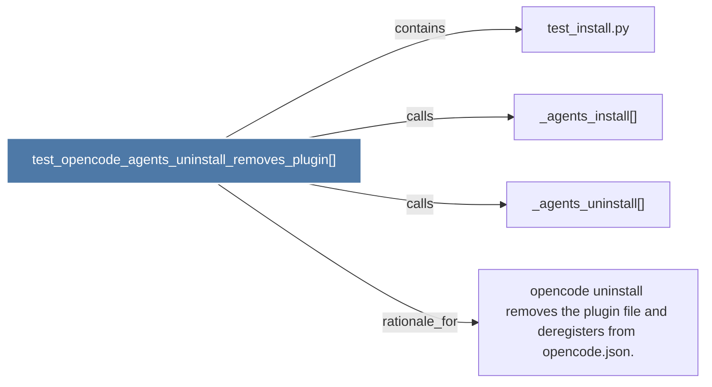

# test_opencode_agents_uninstall_removes_plugin()

> [!info] Properties
> **File Type**: code
> **Community**: [[_COMMUNITY_Community None|Community None]]
> **Degree**: 4

## Architecture Graph


## Outbound Connections
- [[_agents_install()]] - `calls` [EXTRACTED]
- [[_agents_uninstall()]] - `calls` [EXTRACTED]
- [[opencode uninstall removes the plugin file and deregisters from opencode.json.]] - `rationale_for` [EXTRACTED]
- [[test_install.py]] - `contains` [EXTRACTED]

## Inbound Dependencies
> [!abstract]- Files that link here
```dataview
LIST
FROM [[test_opencode_agents_uninstall_removes_plugin()]]
```

#graphify/code #graphify/EXTRACTED #community/Community_None