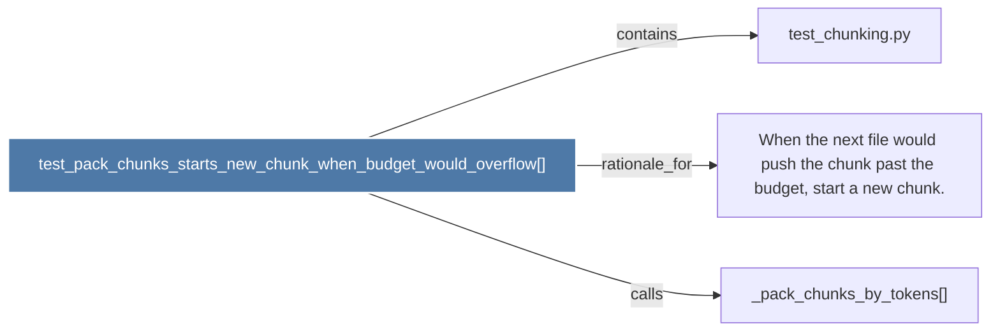

# test_pack_chunks_starts_new_chunk_when_budget_would_overflow()

> [!info] Properties
> **File Type**: code
> **Community**: [[_COMMUNITY_Community None|Community None]]
> **Degree**: 3

## Architecture Graph


## Outbound Connections
- [[When the next file would push the chunk past the budget, start a new chunk.]] - `rationale_for` [EXTRACTED]
- [[_pack_chunks_by_tokens()]] - `calls` [INFERRED]
- [[test_chunking.py]] - `contains` [EXTRACTED]

## Inbound Dependencies
> [!abstract]- Files that link here
```dataview
LIST
FROM [[test_pack_chunks_starts_new_chunk_when_budget_would_overflow()]]
```

#graphify/code #graphify/EXTRACTED #community/Community_None