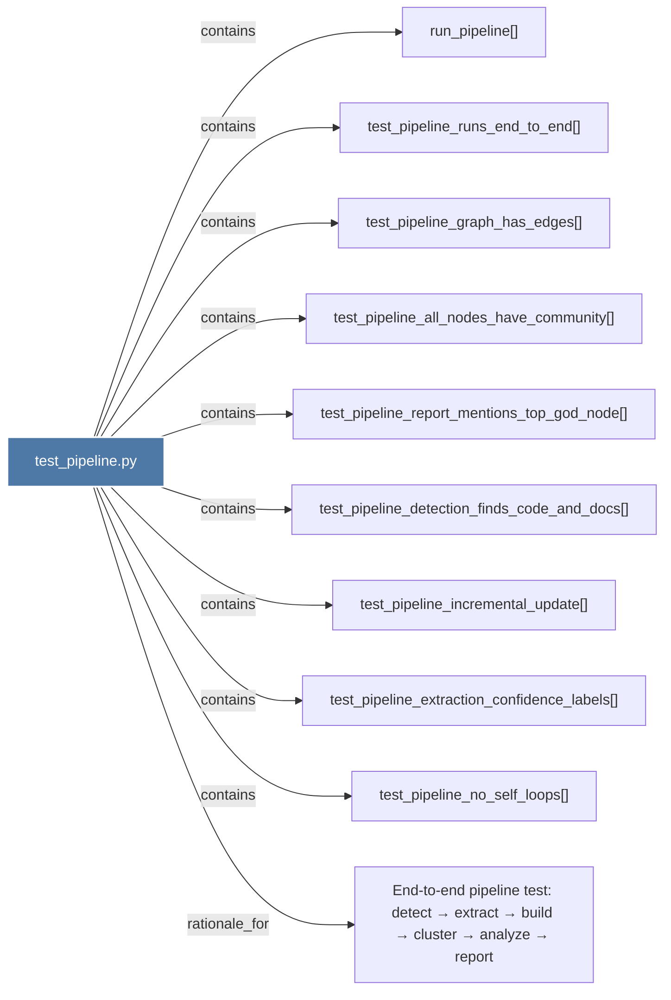

# test_pipeline.py

> [!info] Properties
> **File Type**: code
> **Community**: [[_COMMUNITY_Community None|Community None]]
> **Degree**: 10

## Architecture Graph


## Outbound Connections
- [[End-to-end pipeline test detect → extract → build → cluster → analyze → report]] - `rationale_for` [EXTRACTED]
- [[run_pipeline()]] - `contains` [EXTRACTED]
- [[test_pipeline_all_nodes_have_community()]] - `contains` [EXTRACTED]
- [[test_pipeline_detection_finds_code_and_docs()]] - `contains` [EXTRACTED]
- [[test_pipeline_extraction_confidence_labels()]] - `contains` [EXTRACTED]
- [[test_pipeline_graph_has_edges()]] - `contains` [EXTRACTED]
- [[test_pipeline_incremental_update()]] - `contains` [EXTRACTED]
- [[test_pipeline_no_self_loops()]] - `contains` [EXTRACTED]
- [[test_pipeline_report_mentions_top_god_node()]] - `contains` [EXTRACTED]
- [[test_pipeline_runs_end_to_end()]] - `contains` [EXTRACTED]

## Inbound Dependencies
> [!abstract]- Files that link here
```dataview
LIST
FROM [[test_pipeline.py]]
```

#graphify/code #graphify/EXTRACTED #community/Community_None