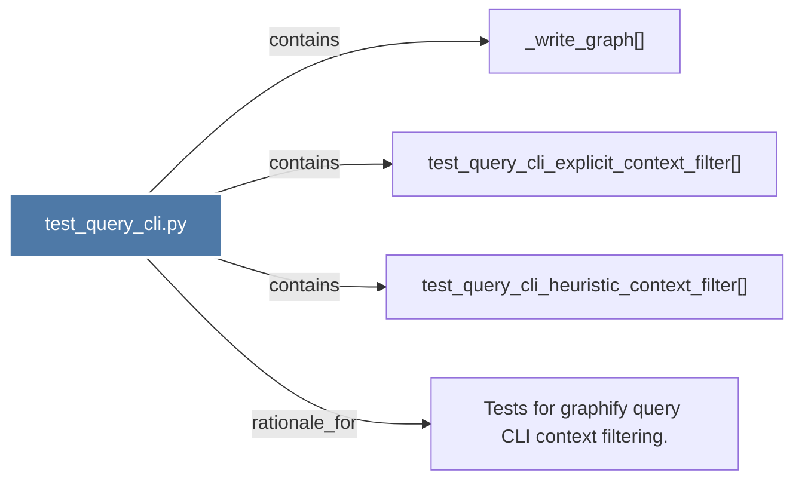

# test_query_cli.py

> [!info] Properties
> **File Type**: code
> **Community**: [[_COMMUNITY_Community None|Community None]]
> **Degree**: 4

## Architecture Graph


## Outbound Connections
- [[Tests for graphify query CLI context filtering.]] - `rationale_for` [EXTRACTED]
- [[_write_graph()_1]] - `contains` [EXTRACTED]
- [[test_query_cli_explicit_context_filter()]] - `contains` [EXTRACTED]
- [[test_query_cli_heuristic_context_filter()]] - `contains` [EXTRACTED]

## Inbound Dependencies
> [!abstract]- Files that link here
```dataview
LIST
FROM [[test_query_cli.py]]
```

#graphify/code #graphify/EXTRACTED #community/Community_None