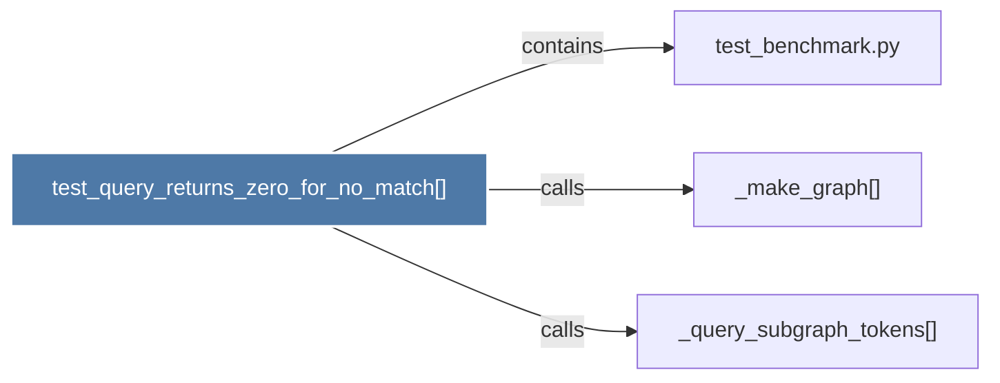

# test_query_returns_zero_for_no_match()

> [!info] Properties
> **File Type**: code
> **Community**: [[_COMMUNITY_Community None|Community None]]
> **Degree**: 3

## Architecture Graph


## Outbound Connections
- [[_make_graph()]] - `calls` [EXTRACTED]
- [[_query_subgraph_tokens()]] - `calls` [INFERRED]
- [[test_benchmark.py]] - `contains` [EXTRACTED]

## Inbound Dependencies
> [!abstract]- Files that link here
```dataview
LIST
FROM [[test_query_returns_zero_for_no_match()]]
```

#graphify/code #graphify/EXTRACTED #community/Community_None