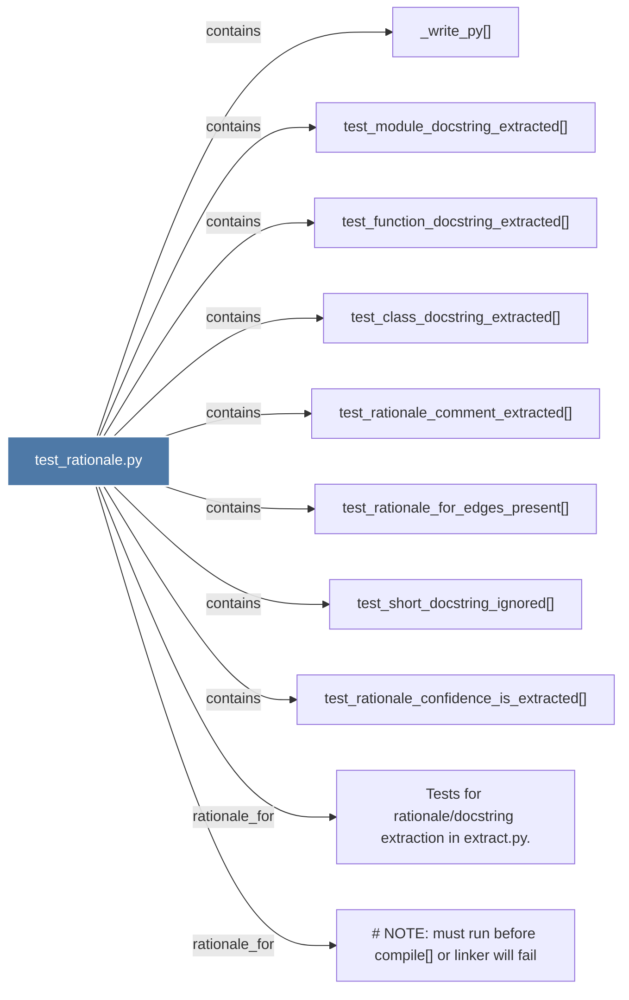

# test_rationale.py

> [!info] Properties
> **File Type**: code
> **Community**: [[_COMMUNITY_Community None|Community None]]
> **Degree**: 10

## Architecture Graph


## Outbound Connections
- [[NOTE must run before compile() or linker will fail]] - `rationale_for` [EXTRACTED]
- [[Tests for rationaledocstring extraction in extract.py.]] - `rationale_for` [EXTRACTED]
- [[_write_py()]] - `contains` [EXTRACTED]
- [[test_class_docstring_extracted()]] - `contains` [EXTRACTED]
- [[test_function_docstring_extracted()]] - `contains` [EXTRACTED]
- [[test_module_docstring_extracted()]] - `contains` [EXTRACTED]
- [[test_rationale_comment_extracted()]] - `contains` [EXTRACTED]
- [[test_rationale_confidence_is_extracted()]] - `contains` [EXTRACTED]
- [[test_rationale_for_edges_present()]] - `contains` [EXTRACTED]
- [[test_short_docstring_ignored()]] - `contains` [EXTRACTED]

## Inbound Dependencies
> [!abstract]- Files that link here
```dataview
LIST
FROM [[test_rationale.py]]
```

#graphify/code #graphify/EXTRACTED #community/Community_None