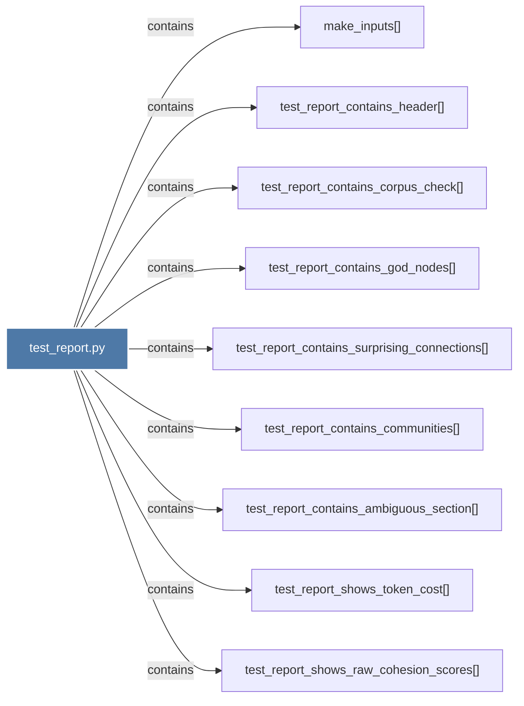

# test_report.py

> [!info] Properties
> **File Type**: code
> **Community**: [[_COMMUNITY_Community None|Community None]]
> **Degree**: 9

## Architecture Graph


## Outbound Connections
- [[make_inputs()]] - `contains` [EXTRACTED]
- [[test_report_contains_ambiguous_section()]] - `contains` [EXTRACTED]
- [[test_report_contains_communities()]] - `contains` [EXTRACTED]
- [[test_report_contains_corpus_check()]] - `contains` [EXTRACTED]
- [[test_report_contains_god_nodes()]] - `contains` [EXTRACTED]
- [[test_report_contains_header()]] - `contains` [EXTRACTED]
- [[test_report_contains_surprising_connections()]] - `contains` [EXTRACTED]
- [[test_report_shows_raw_cohesion_scores()]] - `contains` [EXTRACTED]
- [[test_report_shows_token_cost()]] - `contains` [EXTRACTED]

## Inbound Dependencies
> [!abstract]- Files that link here
```dataview
LIST
FROM [[test_report.py]]
```

#graphify/code #graphify/EXTRACTED #community/Community_None