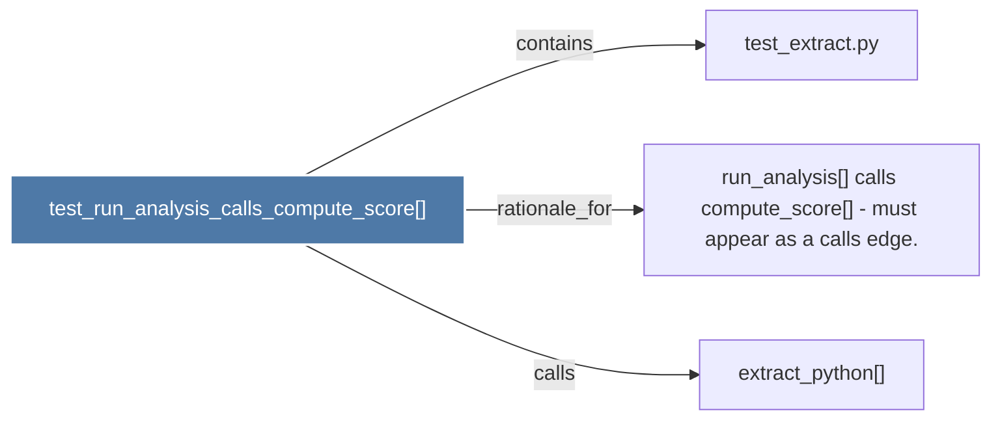

# test_run_analysis_calls_compute_score()

> [!info] Properties
> **File Type**: code
> **Community**: [[_COMMUNITY_Community None|Community None]]
> **Degree**: 3

## Architecture Graph


## Outbound Connections
- [[extract_python()]] - `calls` [INFERRED]
- [[run_analysis() calls compute_score() - must appear as a calls edge.]] - `rationale_for` [EXTRACTED]
- [[test_extract.py]] - `contains` [EXTRACTED]

## Inbound Dependencies
> [!abstract]- Files that link here
```dataview
LIST
FROM [[test_run_analysis_calls_compute_score()]]
```

#graphify/code #graphify/EXTRACTED #community/Community_None