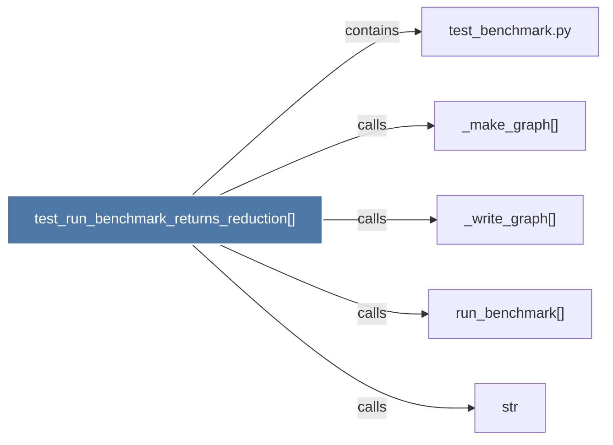

# test_run_benchmark_returns_reduction()

> [!info] Properties
> **File Type**: code
> **Community**: [[_COMMUNITY_Community None|Community None]]
> **Degree**: 5

## Architecture Graph


## Outbound Connections
- [[_make_graph()]] - `calls` [EXTRACTED]
- [[_write_graph()]] - `calls` [EXTRACTED]
- [[run_benchmark()]] - `calls` [INFERRED]
- [[str]] - `calls` [INFERRED]
- [[test_benchmark.py]] - `contains` [EXTRACTED]

## Inbound Dependencies
> [!abstract]- Files that link here
```dataview
LIST
FROM [[test_run_benchmark_returns_reduction()]]
```

#graphify/code #graphify/EXTRACTED #community/Community_None