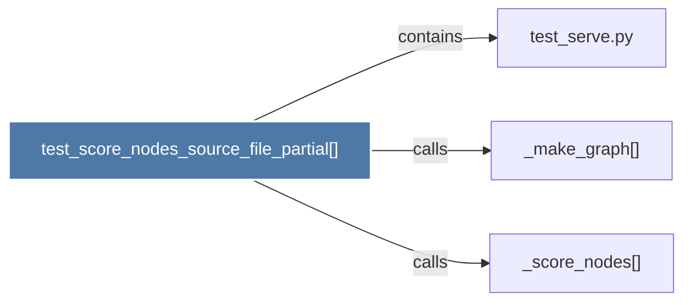

# test_score_nodes_source_file_partial()

> [!info] Properties
> **File Type**: code
> **Community**: [[_COMMUNITY_Community None|Community None]]
> **Degree**: 3

## Architecture Graph


## Outbound Connections
- [[_make_graph()_1]] - `calls` [EXTRACTED]
- [[_score_nodes()]] - `calls` [INFERRED]
- [[test_serve.py]] - `contains` [EXTRACTED]

## Inbound Dependencies
> [!abstract]- Files that link here
```dataview
LIST
FROM [[test_score_nodes_source_file_partial()]]
```

#graphify/code #graphify/EXTRACTED #community/Community_None