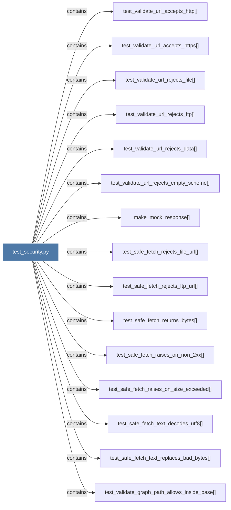

# test_security.py

> [!info] Properties
> **File Type**: code
> **Community**: [[_COMMUNITY_Community None|Community None]]
> **Degree**: 23

## Architecture Graph


## Outbound Connections
- [[Tests for graphifysecurity.py - URL validation, safe fetch, path guards, label]] - `rationale_for` [EXTRACTED]
- [[_make_mock_response()]] - `contains` [EXTRACTED]
- [[test_safe_fetch_raises_on_non_2xx()]] - `contains` [EXTRACTED]
- [[test_safe_fetch_raises_on_size_exceeded()]] - `contains` [EXTRACTED]
- [[test_safe_fetch_rejects_file_url()]] - `contains` [EXTRACTED]
- [[test_safe_fetch_rejects_ftp_url()]] - `contains` [EXTRACTED]
- [[test_safe_fetch_returns_bytes()]] - `contains` [EXTRACTED]
- [[test_safe_fetch_text_decodes_utf8()]] - `contains` [EXTRACTED]
- [[test_safe_fetch_text_replaces_bad_bytes()]] - `contains` [EXTRACTED]
- [[test_sanitize_label_caps_at_256()]] - `contains` [EXTRACTED]
- [[test_sanitize_label_passthrough_html_chars()]] - `contains` [EXTRACTED]
- [[test_sanitize_label_safe_passthrough()]] - `contains` [EXTRACTED]
- [[test_sanitize_label_strips_control_chars()]] - `contains` [EXTRACTED]
- [[test_validate_graph_path_allows_inside_base()]] - `contains` [EXTRACTED]
- [[test_validate_graph_path_blocks_traversal()]] - `contains` [EXTRACTED]
- [[test_validate_graph_path_raises_if_file_missing()]] - `contains` [EXTRACTED]
- [[test_validate_graph_path_requires_base_exists()]] - `contains` [EXTRACTED]
- [[test_validate_url_accepts_http()]] - `contains` [EXTRACTED]
- [[test_validate_url_accepts_https()]] - `contains` [EXTRACTED]
- [[test_validate_url_rejects_data()]] - `contains` [EXTRACTED]
- [[test_validate_url_rejects_empty_scheme()]] - `contains` [EXTRACTED]
- [[test_validate_url_rejects_file()]] - `contains` [EXTRACTED]
- [[test_validate_url_rejects_ftp()]] - `contains` [EXTRACTED]

## Inbound Dependencies
> [!abstract]- Files that link here
```dataview
LIST
FROM [[test_security.py]]
```

#graphify/code #graphify/EXTRACTED #community/Community_None