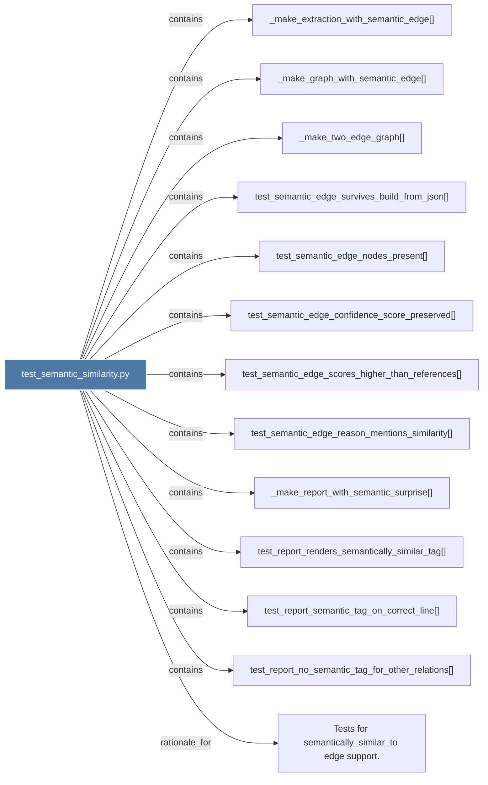

# test_semantic_similarity.py

> [!info] Properties
> **File Type**: code
> **Community**: [[_COMMUNITY_Community None|Community None]]
> **Degree**: 13

## Architecture Graph


## Outbound Connections
- [[Tests for semantically_similar_to edge support.]] - `rationale_for` [EXTRACTED]
- [[_make_extraction_with_semantic_edge()]] - `contains` [EXTRACTED]
- [[_make_graph_with_semantic_edge()]] - `contains` [EXTRACTED]
- [[_make_report_with_semantic_surprise()]] - `contains` [EXTRACTED]
- [[_make_two_edge_graph()]] - `contains` [EXTRACTED]
- [[test_report_no_semantic_tag_for_other_relations()]] - `contains` [EXTRACTED]
- [[test_report_renders_semantically_similar_tag()]] - `contains` [EXTRACTED]
- [[test_report_semantic_tag_on_correct_line()]] - `contains` [EXTRACTED]
- [[test_semantic_edge_confidence_score_preserved()]] - `contains` [EXTRACTED]
- [[test_semantic_edge_nodes_present()]] - `contains` [EXTRACTED]
- [[test_semantic_edge_reason_mentions_similarity()]] - `contains` [EXTRACTED]
- [[test_semantic_edge_scores_higher_than_references()]] - `contains` [EXTRACTED]
- [[test_semantic_edge_survives_build_from_json()]] - `contains` [EXTRACTED]

## Inbound Dependencies
> [!abstract]- Files that link here
```dataview
LIST
FROM [[test_semantic_similarity.py]]
```

#graphify/code #graphify/EXTRACTED #community/Community_None