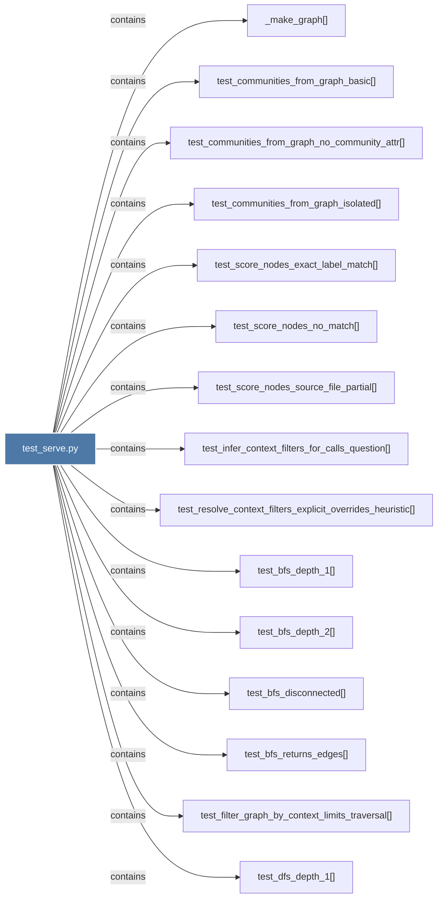

# test_serve.py

> [!info] Properties
> **File Type**: code
> **Community**: [[_COMMUNITY_Community None|Community None]]
> **Degree**: 25

## Architecture Graph


## Outbound Connections
- [[Tests for serve.py - MCP graph query helpers (no mcp package required).]] - `rationale_for` [EXTRACTED]
- [[_make_graph()_1]] - `contains` [EXTRACTED]
- [[test_bfs_depth_1()]] - `contains` [EXTRACTED]
- [[test_bfs_depth_2()]] - `contains` [EXTRACTED]
- [[test_bfs_disconnected()]] - `contains` [EXTRACTED]
- [[test_bfs_returns_edges()]] - `contains` [EXTRACTED]
- [[test_communities_from_graph_basic()]] - `contains` [EXTRACTED]
- [[test_communities_from_graph_isolated()]] - `contains` [EXTRACTED]
- [[test_communities_from_graph_no_community_attr()]] - `contains` [EXTRACTED]
- [[test_dfs_depth_1()]] - `contains` [EXTRACTED]
- [[test_dfs_full_chain()]] - `contains` [EXTRACTED]
- [[test_filter_graph_by_context_limits_traversal()]] - `contains` [EXTRACTED]
- [[test_infer_context_filters_for_calls_question()]] - `contains` [EXTRACTED]
- [[test_load_graph_missing_file()]] - `contains` [EXTRACTED]
- [[test_load_graph_roundtrip()]] - `contains` [EXTRACTED]
- [[test_query_graph_text_explicit_context_filter_changes_traversal()]] - `contains` [EXTRACTED]
- [[test_query_graph_text_heuristic_context_filter_changes_traversal()]] - `contains` [EXTRACTED]
- [[test_resolve_context_filters_explicit_overrides_heuristic()]] - `contains` [EXTRACTED]
- [[test_score_nodes_exact_label_match()]] - `contains` [EXTRACTED]
- [[test_score_nodes_no_match()]] - `contains` [EXTRACTED]
- [[test_score_nodes_source_file_partial()]] - `contains` [EXTRACTED]
- [[test_subgraph_to_text_contains_labels()]] - `contains` [EXTRACTED]
- [[test_subgraph_to_text_edge_included()]] - `contains` [EXTRACTED]
- [[test_subgraph_to_text_includes_edge_context()]] - `contains` [EXTRACTED]
- [[test_subgraph_to_text_truncates()]] - `contains` [EXTRACTED]

## Inbound Dependencies
> [!abstract]- Files that link here
```dataview
LIST
FROM [[test_serve.py]]
```

#graphify/code #graphify/EXTRACTED #community/Community_None