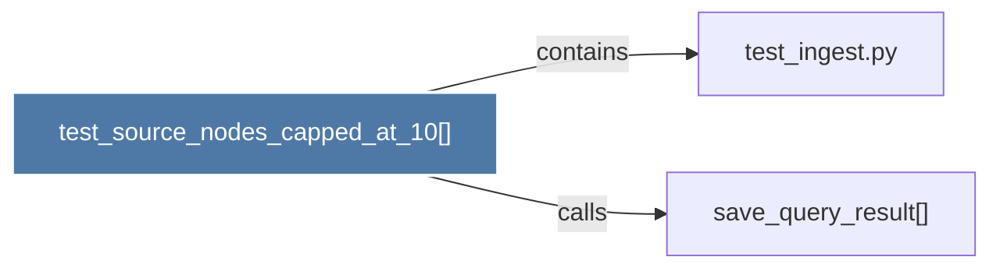

# test_source_nodes_capped_at_10()

> [!info] Properties
> **File Type**: code
> **Community**: [[_COMMUNITY_Community None|Community None]]
> **Degree**: 2

## Architecture Graph


## Outbound Connections
- [[save_query_result()]] - `calls` [INFERRED]
- [[test_ingest.py]] - `contains` [EXTRACTED]

## Inbound Dependencies
> [!abstract]- Files that link here
```dataview
LIST
FROM [[test_source_nodes_capped_at_10()]]
```

#graphify/code #graphify/EXTRACTED #community/Community_None