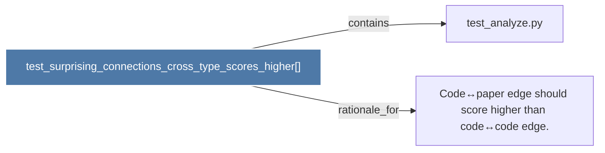

# test_surprising_connections_cross_type_scores_higher()

> [!info] Properties
> **File Type**: code
> **Community**: [[_COMMUNITY_Community None|Community None]]
> **Degree**: 2

## Architecture Graph


## Outbound Connections
- [[Code↔paper edge should score higher than code↔code edge.]] - `rationale_for` [EXTRACTED]
- [[test_analyze.py]] - `contains` [EXTRACTED]

## Inbound Dependencies
> [!abstract]- Files that link here
```dataview
LIST
FROM [[test_surprising_connections_cross_type_scores_higher()]]
```

#graphify/code #graphify/EXTRACTED #community/Community_None