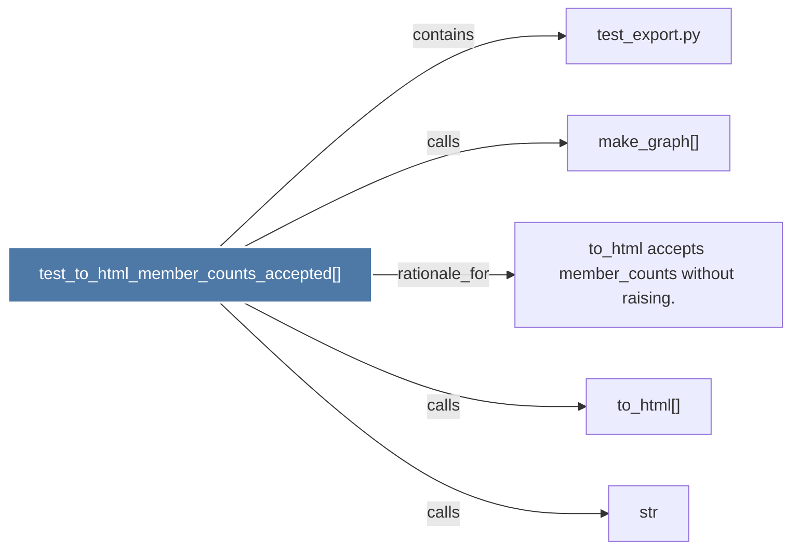

# test_to_html_member_counts_accepted()

> [!info] Properties
> **File Type**: code
> **Community**: [[_COMMUNITY_Community None|Community None]]
> **Degree**: 5

## Architecture Graph


## Outbound Connections
- [[make_graph()]] - `calls` [EXTRACTED]
- [[str]] - `calls` [INFERRED]
- [[test_export.py]] - `contains` [EXTRACTED]
- [[to_html accepts member_counts without raising.]] - `rationale_for` [EXTRACTED]
- [[to_html()]] - `calls` [INFERRED]

## Inbound Dependencies
> [!abstract]- Files that link here
```dataview
LIST
FROM [[test_to_html_member_counts_accepted()]]
```

#graphify/code #graphify/EXTRACTED #community/Community_None