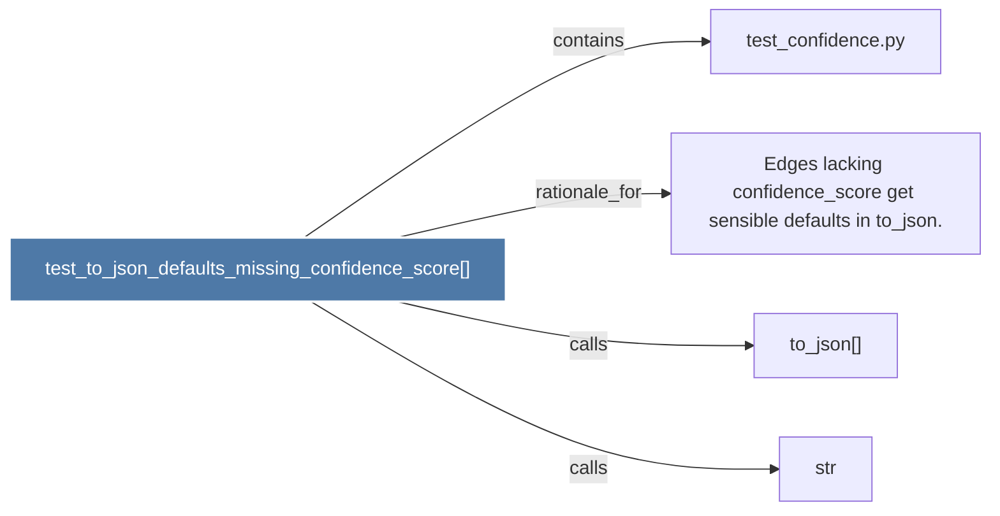

# test_to_json_defaults_missing_confidence_score()

> [!info] Properties
> **File Type**: code
> **Community**: [[_COMMUNITY_Community None|Community None]]
> **Degree**: 4

## Architecture Graph


## Outbound Connections
- [[Edges lacking confidence_score get sensible defaults in to_json.]] - `rationale_for` [EXTRACTED]
- [[str]] - `calls` [INFERRED]
- [[test_confidence.py]] - `contains` [EXTRACTED]
- [[to_json()]] - `calls` [INFERRED]

## Inbound Dependencies
> [!abstract]- Files that link here
```dataview
LIST
FROM [[test_to_json_defaults_missing_confidence_score()]]
```

#graphify/code #graphify/EXTRACTED #community/Community_None