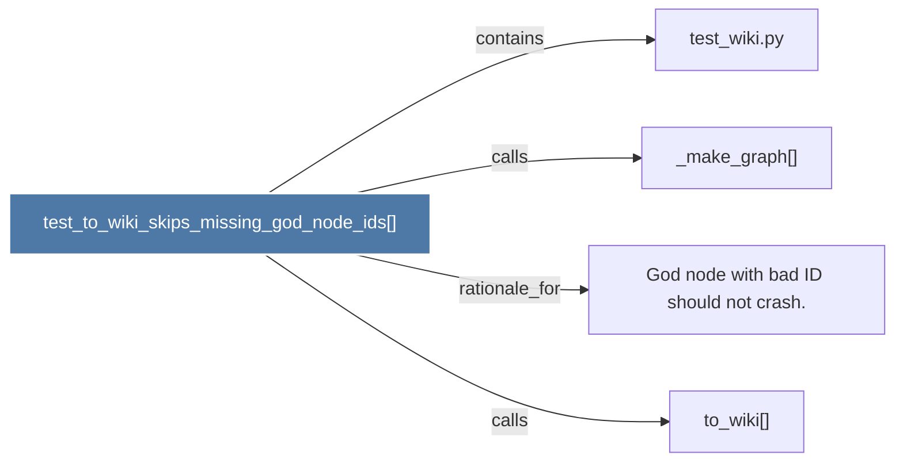

# test_to_wiki_skips_missing_god_node_ids()

> [!info] Properties
> **File Type**: code
> **Community**: [[_COMMUNITY_Community None|Community None]]
> **Degree**: 4

## Architecture Graph


## Outbound Connections
- [[God node with bad ID should not crash.]] - `rationale_for` [EXTRACTED]
- [[_make_graph()_2]] - `calls` [EXTRACTED]
- [[test_wiki.py]] - `contains` [EXTRACTED]
- [[to_wiki()]] - `calls` [INFERRED]

## Inbound Dependencies
> [!abstract]- Files that link here
```dataview
LIST
FROM [[test_to_wiki_skips_missing_god_node_ids()]]
```

#graphify/code #graphify/EXTRACTED #community/Community_None