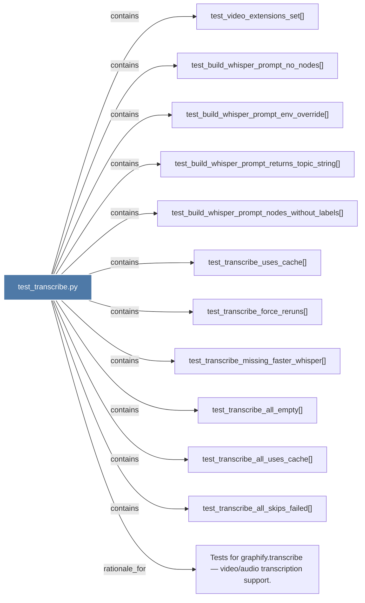

# test_transcribe.py

> [!info] Properties
> **File Type**: code
> **Community**: [[_COMMUNITY_Community None|Community None]]
> **Degree**: 12

## Architecture Graph


## Outbound Connections
- [[Tests for graphify.transcribe — videoaudio transcription support.]] - `rationale_for` [EXTRACTED]
- [[test_build_whisper_prompt_env_override()]] - `contains` [EXTRACTED]
- [[test_build_whisper_prompt_no_nodes()]] - `contains` [EXTRACTED]
- [[test_build_whisper_prompt_nodes_without_labels()]] - `contains` [EXTRACTED]
- [[test_build_whisper_prompt_returns_topic_string()]] - `contains` [EXTRACTED]
- [[test_transcribe_all_empty()]] - `contains` [EXTRACTED]
- [[test_transcribe_all_skips_failed()]] - `contains` [EXTRACTED]
- [[test_transcribe_all_uses_cache()]] - `contains` [EXTRACTED]
- [[test_transcribe_force_reruns()]] - `contains` [EXTRACTED]
- [[test_transcribe_missing_faster_whisper()]] - `contains` [EXTRACTED]
- [[test_transcribe_uses_cache()]] - `contains` [EXTRACTED]
- [[test_video_extensions_set()]] - `contains` [EXTRACTED]

## Inbound Dependencies
> [!abstract]- Files that link here
```dataview
LIST
FROM [[test_transcribe.py]]
```

#graphify/code #graphify/EXTRACTED #community/Community_None