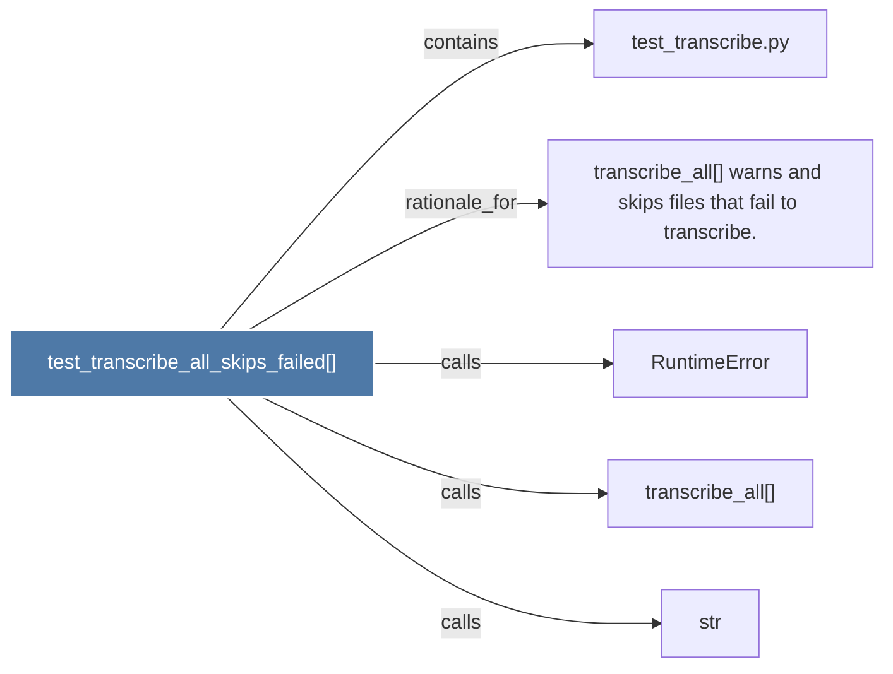

# test_transcribe_all_skips_failed()

> [!info] Properties
> **File Type**: code
> **Community**: [[_COMMUNITY_Community None|Community None]]
> **Degree**: 5

## Architecture Graph


## Outbound Connections
- [[RuntimeError]] - `calls` [INFERRED]
- [[str]] - `calls` [INFERRED]
- [[test_transcribe.py]] - `contains` [EXTRACTED]
- [[transcribe_all()]] - `calls` [INFERRED]
- [[transcribe_all() warns and skips files that fail to transcribe.]] - `rationale_for` [EXTRACTED]

## Inbound Dependencies
> [!abstract]- Files that link here
```dataview
LIST
FROM [[test_transcribe_all_skips_failed()]]
```

#graphify/code #graphify/INFERRED #community/Community_None